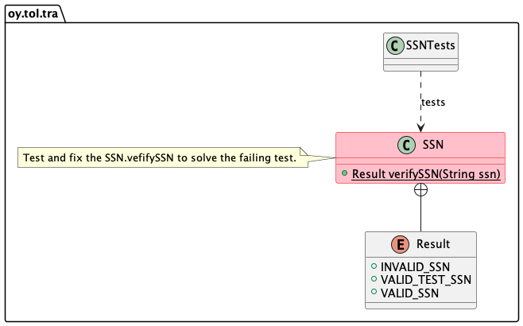

# Harjoitus 0

## Tavoitteet

Tämän harjoituksen tavoitteina on:

1. varmistaa että kurssilla tarvittavat työkalut on asennettu oikein ja että voit käyttää niitä. Lista tarvittavista työkaluista löytyy tämän repositoryn ylimmän tason hakemiston `TOOLS.md` -tiedostosta.
1. näyttää kuinka koodia yksikkötestataan, sillä kaikki kurssin harjoitukset ja harjoitustyöt ovat yksikkötestattavia.
1. tarjota oppimistilaisuus siitä, miten yksikkötesteillä voidaan löytää koodista ongelmia, analysoida ongelmia ja korjata ne.
1. tarjota tilaisuus harjoitella miten voit toimittaa git:n avulla harjoituksen arviointia varten omaan yksityiseen etärepositoryysi.

Yksikkötestit ovat siis *tärkeitä* koko kurssin suorituksen ajan:

1. testaat harjoitustehtävät ennen kuin toimitat ne arvioitavaksi ja arvosteltavaksi. Samalla näet itsekin toimiiko ratkaisusi.
1. opettajat käyttävät automaattisia testejä palauttamiesi harjoitustehtävien ja harjoitustöiden arvioimiseksi kun kurssisuorituksesi arvostellaan.

Jos palautettujen tehtävien yksikkötesti(t) epäonnistuvat, se vaikuttaa siihen paljonko pisteitä saat. Tiedät siis itsekin että jos testit menevät läpi, todennäköisesti tehtävä menee läpi. Huomioi kuitenkin että vaikka testit menisivät läpi, koodia voidaan arvioida myös silmämääräisesti ja toteutuksen laatu voi vaikuttaa pisteytykseen.

> Huomaa että yksikkötestejä tai testidataa ei saa muuttaa ellei yksittäisessä harjoituksessa nimenomaan toisin sanota. Testit ja testidata korvataan joka tapauksessa tarkastuksen yhteydessä alkuperäisillä aineistoilla joten näiden muuttaminen ei auta testien läpäisemisessä.

## Harjoituksen 0 askeleet

Harjoituksen koodin luokkarakenne näkyy alla olevassa UML -luokkamallissa.



Luokan `SSN` metodi `verifySSN` saa parametrina merkkijonon. Metodi tarkistaa onko merkkijono validi suomalainen henkilötunnus. Metodi palauttaa jonkun `Result` enumeraation arvoista joka kertoo tuloksen. Metodi ei saa aiheuttaa poikkeuksia tarkistaessaan henkilötunnusta.

Voit tehdä kaikki askeleet terminaali-ikkunassa. Testien suorittaminen VS Codesta käsin kuvataan alempana.

1. Vaihda hakemistoon (cd -komento) jossa tämä projekti `00-init` on (löydät projektin `pom.xml` tiedoston tästä `00-init` -hakemistosta).
1. Suorita komento `mvn test`.
1. Huomaat että jotkut testeista epäonnistuvat. Tutki epäonnistunutta testiä; yritä ymmärtää miksi testi epäonnistuu.
1. Kun ymmärrät missä vika on, pohdi miten se korjataan ja korjaa ongelma `SSN.verifySSN()` -metodissa, joka aiheuttaa testin epäonnistumisen..
1. Jos et löydä ongelmaa tai sen juurisyytä, yritä käyttää VS Coden debuggeria. Askella koodia ja pohdi missä kohti vika syntyy, mikä se on ja miten sen voisi korjata.
1. Kun olet mielestäsi korjannut ongelman, suorita testit uudelleen. Saitko korjattua vian?

Huomaa että on *erittäin*  tärkeää todellakin *keskittyä* lukemaan virheitä kuvaavat viestit jotka näet kun testi epäonnistuu. Virheilmoitukset näyttävät tärkeää tietoa jota tarvitset kun lähdet analysoimaan mikä on se ongelma joka aiheuttaa testin epäonnistumisen:

```console
[INFO] -------------------------------------------------------
[INFO]  T E S T S
[INFO] -------------------------------------------------------
[INFO] Running oy.tol.tra.SSNTests
[ERROR] Tests run: 3, Failures: 0, Errors: 1, Skipped: 0, Time elapsed: 0.014 s <<< FAILURE! - in oy.tol.tra.SSNTests
[ERROR] invalidSSNTests  Time elapsed: 0.003 s  <<< ERROR!
java.lang.NumberFormatException: For input string: "1p4"
	at oy.tol.tra.SSNTests.invalidSSNTests(SSNTests.java:46)
```
Tästä virheilmoituksesta voit löytää **neljä tärkeää tosiasiaa**:

1. Testien suorittaminen johti virheeseen; **ERROR**.
1. Virhe ilmeni siten, että poikkeus (exception) **NumberFormatException** heitettiin (throw).
1. Syy virheelle on se, että koodi yritti muuntaa merkkijonon **"1p4"** kokonaisluvuksi.
1. Virhe ilmeni testitiedostossa **SSNTests.java**, näet myös rivinumeron jolla testi huomasi virheen.

Nämä tosiasiat osoittavat sinulle suunnan josta voit lähteä tutkimaan ongelmaa ja suunnittelemaan miten tämän ongelman voisit ratkaista.

> Toistan: älä muuta testejä, muuta SSN -luokan toteutusta -- ongelma on testauksen kohteessa, ei testeissä.

## Testaus VS Codesta käsin

Komentorivin sijaan, voit suorittaa testit myös  Visual Studio Codesta käsin. Voit lukea ohjeet testien suorittamisesta [VS Coden dokumentaatiosta](https://code.visualstudio.com/docs/java/java-testing).

1. Avaa projekti VS Codessa avaamalla hakemisto (folder, directory) jossa projekti on (löydät kaikista projekteista oman tiedoston `pom.xml` joka kuvaa projektin). Älä avaa tätä tiedostoa tai mitään projektin .java tiedostojakaan, vaan tämä *hakemisto*. Valitse valikosta komento: File > Open... tai Open Folder... ja valitse *hakemisto* `00-init`. Katso kurssin demovideosta esimerkkiä.
1. VS Code avaa projektin ja luo omat tiedostonsa projektin tukemiseksi. Tässä voi kestää hetki.
1. Vaihda VS Coden näkymä testinäkymään -- Vasemmalla näet symbolin joka näyttää **laboratoriopullolta**. Klikkaa sitä. Joskus testinäkymänapin ilmestyminen voi viedä aikaa, joten odota kärsivällisesti ja tutki odotellessa vaikka koodia.

Näet listan testejä jotka ovat projektissa valmiina. Voit avata listaa pienestä väkäsestä testin nimen vasemmalla puolella, jolloin näet lisää testejä ja testimetodeja. Lisäksi kun viet hiiren yksittäisen testin tai testimetodin päälle, listalle ilmestyy nappeja joista voit käynnistää testin tai testejä.

Testi suoritetaan **Run** -komennolla (oikealle osoittava kolmio). Lisäksi voit **debugata** testejä (oikealle osoittava kolmio jossa bugin kuva). Testien debuggaus on erittäin hyödyllistä kun yrität askeltaa koodia lause kerrallaan analysoidessasi missä kohtaa virhe tapahtuu ja haluat katsoa mitä muuttujien arvot ovat ennen virheen tapahtumista.

Debuggaamisesta näet esimerkkejä kurssin demovideoissa ja harjoituksissa. Opettele debuggaamaan viimeistään tässä vaiheessa ohjelmoinnin opettelua; se on erittäin hyödyllinen taito. Ohjeita siitä miten VS Codella debugataan löydät myös [työkalun ohjesivuilta](https://code.visualstudio.com/docs/java/java-debugging). 

Tarvitset debuggaustaitojasi myös muiden harjoitusten ja harjoitustyön toteuttamisessa myöhemmin kurssilla. 

## Toimittaminen arvioitavaksi

Kun olet saanut ongelman ratkaistua ja testit menevät läpi, toimita ratkaistu harjoitus opettajien arvioitavaksi omaan yksityiseen etärepositoryysi. Tämä `00-init` -harjoitus ei ole arvosteltava suoritus eikä vaikuta arvosanaasi, mutta se on hyvä harjoitus siitä miten muut arvioitavat harjoitukset tehdään ja palautetaan.

Askeleet miten tämä tapahtuu, ovat alla. Tässä tietysti oletetaan että olet hakenut oman etärepositoryssä olevan koodisi omalle koneellesi `git clone` -komennolla kuten tämän repositoryn `SETUP.md` -tiedostossa on ohjeistettu.

Löydät myös kaikkien tehtävien juurihakemistosta tiedoston `GIT-CHEAT-SHEET.md` jossa lyhyt esittely kurssilla tarvittavista git -komennoista. Jos et muista komentoja, täältä voit lähteä liikkeelle, ja verkkohaut auttavat myös.

1. **Varmista** että korjauksesi toimii suorittamalla testit komennolla: `mvn test`. Tai suorita testit VS Codesta käsin.
1. **Varmista** mikä olikaan etärepositorysi osoite mistä kloonasit sen omalle koneellesi komennolla `git remote -v`.
1. **Katso** mitä tiedostoja muutit komennolla `git status`. Tässä harjoituksessa et luonut uusia tiedostoja joten sinun pitäisi nähdä vain muuttuneita tiedostoja. Siksi mitään uusia tiedostoja ei tarvitse lisätä harjoitukseen, tämä tehtäisiin komennolla `git add`.
1. Jos tarpeen tai sinua kiinnostaa, katso **mitä muutit** koodista komennolla `git diff`.
1. Jos testit menevät läpi ja kaikki tuntuu olevan kunnossa, olet valmis muutosten viemiseen sekä paikalliseen että etärepositoryyn.
1. **Vahvista (commit)** muutokset paikalliseen git-repositoryyn komennolla `git commit -am"Commit -viestisi tähän"`. Kirjoita *merkityksellisiä* commit -viestejä, jotka kuvaavat mitä ongelmia ratkaisit tässä commit:ssa tai mitä uusia asioita sait tehtyä.
1. **Julkaiset** muutokset oman koneen repositorystä etärepositoryyn käyttäen komentoa `git push`. Huomaa että jos et tätä tee, koodi on vain oman koneesi repositoryssä, ei etärepositoryssä. Opettajat eivät näe koodia oman koneesi repositoryssä, ainoastaan koodin joka on etärepositoryssä.
1. **Varmista** että koodi jonka työnsit etärepositoryyn, on todellakin siellä. Avaa etärepositorysi osoite webbiselaimella ja käy katsomassa että kaikki muutokset ovat siellä.

## Ongelmia, kysymyksiä?

Kysy apua ongelmiin ja lisätietoja kurssin luennoilla, harjoituksissa tai oppimisympäristöissä.

## Tietoja

* Kurssi: Tietorakenteet ja algoritmit | Data structures and algorithms 2022.
* Tietojenkäsittelytieteet, Tieto- ja sähkötekniikan tiedekunta, Oulun yliopisto.
* (c) Antti Juustila 2021-2022, INTERACT Research Group.
