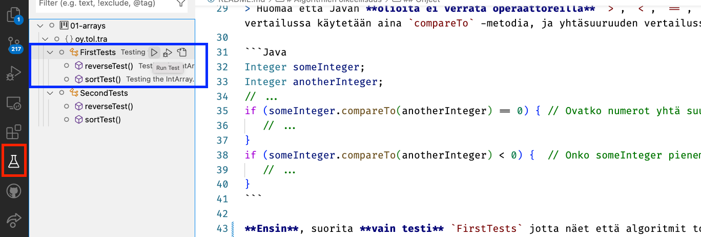

# Algoritmien oikeellisuus

Tietorakenteet ja algoritmit.

## Harjoituksen tavoite

* Tavoitteena on analysoida kahden yksinkertaisen algoritmin oikeellisuutta.
* Kun olet analysoinut ja testannut algoritmeja, huomaat että ne eivät ole oikeellisia. Analysoi syy ja korjaa virhe.
* Kun algoritmit toimivat, tee niistä *geneerisiä*, sillä näistä algoritmeista on hyötyä myöhemmissä harjoituksissa -- geneerisinä.

Huomaa että molemmat algoritmit on toteutettava "in-place", eli tässä **ei pidä** luoda uusia taulukoita joiden avulla taulukon elementtien järjestyksien muuttaminen tehtäisiin.

Huomaa myös että **et saa käyttää** tässä (kuten et muissakaan harjoituksissa, jos toisin ei sanota) Javan valmiita algoritmeja tai säiliötietorakenteita, esim. luokissa `Arrays`, `Collections`, `Array`, `ArrayList`, tai mitään muutakaan. Algoritmit ja tietorakenteet toteutetaan tällä kurssilla itse.

## Edeltävät tehtävät

Kurssilla tarvittavat työkalut on asennettu ja olet testannut että ne toimivat. Tämä tehtiin harjoituksessa `00-init`. Jos et ole vielä tehnyt sitä harjoitusta, tee se ensin.

Geneerinen vaihtolajittelu on ollut yhden tehtävä aihe Ohjelmointi 2 -kurssilla. Tarvittaessa kertaa geneerisyyttä Javassa Ohjelmointi 2:n materiaaleista. Vaihtolajittelusta löytyy linkki sen esittelyyn alempana tässä ohjeessa.

## Ohjeet

UML luokkamalli alla kuvaa tämän harjoituksen entiteetit.


`Grades` on luokka joka sisältää taulukossa opiskelijoiden arvosanoja `Integer` -luokan olioissa. Näitä arvosanoja voidaan sitten **lajitella** (sort) ja järjestys **kääntää** (reverse) päinvastaiseksi.

> Huomaa että Javan **olioita ei verrata operaattoreilla** `>`, `<`, `==`, `!=` ja niin edelleen. Olioiden vertailussa käytetään aina `compareTo` -metodia, ja yhtäsuuruuden vertailussa `equals` -metodia!:

```Java
Integer someInteger;
Integer anotherInteger;
// ...
if (someInteger.compareTo(anotherInteger) == 0) { // Ovatko numerot yhtä suuret?
   // ...
}
if (someInteger.compareTo(anotherInteger) < 0) {  // Onko someInteger pienempi kuin anotherInteger.
   // ...
}
```

**Ensin**, suorita **vain testi** `FirstTests` jotta näet että algoritmit toimivat oikein. Voit suorittaa vain tämän testin komentoriviltä:

```console
mvn -Dtest=FirstTests test
```

Tai VS Codesta käsin valitsemalla testinäkymä (labrapullosymboli, korostettu punaisella) ja avaamalla testit ja suorittamalla play -painikkeesta **vain** tuo FirstTests -testi (korostettu sinisellä):



Virheitä ei pitäisi tulla. Algoritmit jotka lajittelevat (sort) taulukon ja muuttavat sen sisällön käänteiseksi (reverse) toimivat oikein. 

Se että testit menevät läpi on vain illuusio. Testit eivät huomaa tilannetta jossa algoritmit epäonnistuvat, eli testit ovat riittämättömiä. Tarkemmin sanottuna, testiaineisto on aivan liian suppea. Sekä `reverse()` että `sort()` metodeissa on bugeja.

**Suorita nyt** `SecondTests` -testit, komentoriviltä:

```console
mvn -Dtest=SecondTests test
```
Ja VS Codesta klikkaamalla SecondTests -testin oikealla puolella olevaa play -nappia.

Nyt testit epäonnistuvatkin enimmäkseen. Silloin tällöin jompi kumpi testi saattaa mennä läpi, mutta ei aina.


### Ensin keskity reverse -metodiin

Tutki testikoodeja, erityisesti molempien testien sitä metodia joka luo testattavan taulukon. 

Löydätkö selityksen sille miksi joskus reverse -testi onnistuu ja joskus taas ei. Mitä eroa on onnistuneella testiaineistolla verrattuna epäonnistuneeseen testiin ja sen aineistoon?

Sinun tulisi huomata että testit paljastavat ettei algoritmi aina toimi oikein.

* **Tutki koodia** ja yritä *järkeillä* mikä on vialla algoritmin toteutuksessa. Käytä kynää ja paperia jotta ymmärtäisit mitä algoritmi tekee kun "suoritat" sitä omassa päässäsi kynän ja paperin avulla.
* **Debuggaa** koodia VS Coden debuggerilla (käynnistä testi play -napin vieressä olevalla play napilla jossa ötökän kuva!), asettamalla koodiin pysäytyspisteitä (breakpoint). Askella koodia lause kerrallaan jotta näet mitä tapahtuu. Tarkastele muuttujien arvoja jokaisen askeleen jälkeen ja pohdi ovatko ne sitä mitä pitäisi olla vai tapahtuiko jotain mitä ei olisi pitänyt tapahtua.

Kun ymmärrät mikä ongelma `Grades.reverse()`:n toteutuksessa on, **korjaa se**. Suorita testejä uudelleen -- poistuuko ongelma, onko algoritmi korjauksesi jälkeen oikeellinen? Varmista että tällä kertaa testaat algoritmia tarpeeksi monta kertaa erilaisilla testiaineistoilla.

### Sitten keskity sort -metodiin

Huomasit alussa että alkuperäinen sort -testi meni läpi. **Miksi toiset testit eivät mene läpi?** Varmista että testaat erilaisilla taulukoilla joissa on eri määrä numeroita erilaisissa järjestyksissä. Huomaatko jotain logiikkaa siinä miten virhe esiintyy?

Sinun tulisi huomata että testit paljastavat ettei algoritmi aina toimi oikein.

* **Tutki koodia** ja yritä *järkeillä* mikä on vialla algoritmin toteutuksessa. Käytä kynää ja paperia jotta ymmärtäisit mitä algoritmi tekee kun "suoritat" sitä omassa päässäsi kynän ja paperin avulla.
* **Debuggaa** koodia VS Coden debuggerilla, asettamalla koodiin pysäytyspisteitä (breakpoint). Askella koodia lause kerrallaan jotta näet mitä tapahtuu. Tarkastele muuttujien arvoja jokaisen askeleen jälkeen ja pohdi ovatko ne sitä mitä pitäisi olla vai tapahtuiko jotain mitä ei olisi pitänyt tapahtua.

Kun ymmärrät mikä ongelma `Grades.sort()`:n toteutuksessa on, **korjaa se**. Suorita testejä uudelleen, erilaisilla testiaineistoilla -- poistuuko ongelma, onko algoritmi korjauksesi jälkeen oikeellinen? Varmista että tällä kertaa testaat algoritmia tarpeeksi erilaisilla testiaineistoilla.

> Vinkki: tässä kannattaa huomata ettei taulukoiden lajittelussa yksi silmukka riitä. Kokeile esimerkiksi yksinkertaista lisäyslajittelua, jonka pseudokoodin löydät täältä:

https://en.wikipedia.org/wiki/Insertion_sort

Kun olet saanut korjattua nämä algoritmit niin että ne toimivat erilaisilla testiaineistoilla oikein, jatka seuraavaan vaiheeseen.

> HUOM: Jos korjaat lajittelualgoritmin niin, että aina kun taulukon numeroiden paikkaa pitää vaihtaa, aloitat lajittelun lopusta uudelleen, et saa tehtävästä pisteitä. Tämä on *niin huono* lajittelualgoritmi. Katso siis vaikka tuo vaihtolajittelu tai vaikkapa kuplalajittelu (bubble sort) ja toteuta se. Älä kuitenkaan tässä vaiheessa lähde toteuttamaan mitään hienompaa ja monimutkaisempaa lajittelua, sillä se on myöhemmän harjoituksen aihe.

## Tee algoritmeista geneerisiä

`Grades`:n `sort()` ja `reverse()` toimivat vain kokonaislukujen (`Integer`) kanssa. Taulukoiden lajittelu ja elementtien järjestäminen päinvastaiseen järjestykseen ovat kuitenkin asioita joita voi tehdä kaiken tyyppisille elementeille, ei pelkästään `Integer` -olioille -- kunhan elementtien välinen vertailu on mahdollista.

**Luo uusi tiedosto** `Algorithms.java` ja toteuta siellä lajittelu ja järjestyksen kääntäminen *geneerisinä algoritmeina*.

**TÄRKEÄÄ** Myöhemmät harjoitukset ja testit hyödyntävät näitä algoritmeja. Joten huolehdi että metodien sort ja reverse -rajapinnat tässä `Algorithms` -luokassa näyttävät **täsmälleen** tältä:

```Java
public static <T extends Comparable<T>> void sort(T [] array) {
   // toteutus tähän...

// ...
public static <T> void reverse(T [] array) {
   // toteutus tähän... 
```

**Muuta** `Grades` -luokan toteutusta niin että se käyttää `Algorithms` -luokan geneerisiä algoritmeja.

Kertaa tarvittaessa geneeriset luokat ja metodit Ohjelmointi 2:n materiaaleista. Harjoituksissa ja luennoilla kerrataan perusteet näistä, joten osallistu kurssin luennoille ja harjoituksiin jos tämä tuntuu vaikealta.

**Huomaa** myös että sekä `sort` että `reverse` vaihtavat (toteutuksesta riippuen sort) kahden taulukon alkion paikkaa keskenään. On siis Hyvä Idea(tm) tehdä tästä vaihto-operaatiosta `Algorithms` -luokkaan oma metodinsa `swap`:

```Java 
public static <T> void swap(T [] array, int first, int second)
```

jota molemmat, `sort` ja `reverse`, kutsuvat. Metodi vaihtaa first ja second -indekseissä olevien elementtien paikkaa keskenään.

Huomaa että **toteuttamaasi geneeristä lajittelua tarvitaan seuraavissa harjoituksissa**, joten älä hypi turhaan asioiden edelle.

## Lopullinen, geneerisen toteutuksen testi

Projektissa on mukana sen juurihakemistossa `GenericTests.java` -tiedosto. **Siirrä se** testikoodien hakemistoon `src/test/java/oy/tol/tra` -hakemistoon. Nyt voit testata tällä testillä geneeristä toteutustasi. Se testaa toteutetut `reverse` ja `sort` -metodit sekä `Integer` että `String` -taulukoilla.

Kun testit menevät läpi, voit palauttaa tehtävän ja jatkaa seuraavaan.

## Palauttaminen

Kun olet analysoinut algoritmien ongelman ja korjannut sen, ja testannut että korjauksesi toimii myös geneerisenä, voit palauttaa tehtävän kurssin ohjeiden mukaisesti, git:iä ja etärepositoryäsi käyttäen.

**Älä unohda** lisätä `Algorithms.java` -tiedostoa `git add` -komennolla ennen kuin teet commitin ja työnnät harjoituksen etärepositoryysi `git push` -komennolla! Muista myös commitoida se muutos että siirsit `GenericTests.java` -tiedoston testihakemistoon!

## Ongelmia, kysymyksiä?

Osallistu kurssin luennoille, harjoituksiin ja verkkofoorumeille, kysy apua ja ohjeita.

Jos sinulla on ongelmia työkalujen kanssa, varmista että sinulla on oikea JDK asennettuna ja käyttöjärjestelmäsi ympäristömuuttujat (environment variables, `PATH` ja `JAVA_HOME`) osoittavat oikeaan JDK:n hakemistoon. Varmista että Maven on myös asennettu oikein ja git toimii.

## Tietoja

* Kurssimateriaalia Tietorakenteet ja algoritmit -kurssille | Data structures and algorithms 2021-2022.
* Tietojenkäsittelytieteet, Tieto- ja sähkötekniikan tiedekunta, Oulun yliopisto.
* (c) Antti Juustila 2021-2022, INTERACT Research Group.