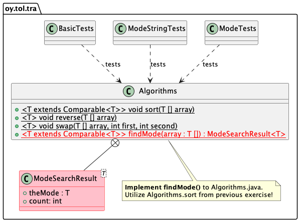

# Mode exercise

Tietorakenteet ja algoritmit | Data structures and algorithms.

## The goal

The goal of this exercise is to implement an algorithm to find a *mode* from an array of numbers.

The mode of a sequence of numbers is the number that occurs most often in the sequence. For example, the mode of the sequence `[3.0, 1.0, 2.0, 5.5, 3.0 ,3.0, 4.5, 1.0, 4.0, 4.5, 3.0, 5.5]` is `3.0`, since it is in the array four times, more than any other number. 

**Design and implement** an algorithm that finds the *mode* from an input array. 

> Note that here the goal is to use as little as possible additional memory. Try to cope with just a couple of new variables. Do not use additional arrays for the job!

> Tip: sorting may help. You already implemented a generic sorting algorithm in `01-arrays` you can use here.

**Copy** the `Algorithms.java` file from the 01-arrays exercise to the place where the source code for this exercise are (`src/main/java/oy/tol/tra`). Use the algorithms from there that are useful in this exercise.

## Prerequisites

You have all the tools installed and working. This was tested in the `00-init` exercise of the course. If you haven't done that yet, do it now. Make sure you use the sorting algorithm you implemented in previous exercise.

**Copy** the `Algorithms.java` from the previous exercise into the exercise source code directory (`src/main/java/oy/tol/tra`).

## Instructions

**Implement** in your `Algorithms` class a *generic* method `Algorithms.findMode()` so that it finds from the given array the mode value. **Use** the declarations given below! Tests assume exactly these interfaces, and do not work if these are different from below.

You will need in your `Algorithms` class a helper class as an inner class. Your method will return this object that contains the value of the mode and the count of times it was in the array:

```Java
   public static class ModeSearchResult<T> {
      public T theMode;
      public int count = 0;
   }

   public static <T extends Comparable<T>> ModeSearchResult<T> findMode(T [] array) {
      ModeSearchResult<T> result = new ModeSearchResult<>();
      // ...      
      return result;
   }
```
Your implementation **must** take into account the situations where the array parameter is null or the array has so few elements that mode cannot be determined. In these situations, the returned `ModeSearchResult.theMode` must be `null`and the `ModeSearchResult.count` must be -1.

> You may, however, assume that the array always has one value more than any other. That is, the mode can always be found. The tests make sure of this. So your algorithm must always find this mode and the count how many times it is in the array, must be correct.

See the UML class model below for the structure of this exercise.



Your method must return a `ModeSearchResult` object, containing the mode value and the count of times it was in the array.

The tests print out tab separated lines of measurements using different array sizes.

## Testing 

**First**, execute the `BasicTests` test to see that your implementation works with simple situations and small arrays.

```console
mvn -Dtest=BasicTests test
```

* when the array is null, the result mentioned above must be returned,
* when the array has too few elements to search for the mode, the result mentioned above must be returned,
* tests with an array [1,1], if the code returns that value 1 was round two times from the array and is the mode,
* tests with various four element arrays if the correct mode is found.

If the basic test passes, then **run all the tests** to make sure your implementation passes the unit tests. These tests use various sizes of `Double` and `String` arrays. From command line, you can  execute the tests (in the directory that contains the exercise `pom.xml` file):

```
mvn test
```

If the tests do not pass, you will see errors. Otherwise you will see that the tests succeed. If you have issues, fix your implementation and try again.

When running the tests, note how the execution time increases while the size of the arrays grows:

```console
[INFO] Running oy.tol.tra.ModeStringTests
Testing findMode with Strings
Array size (n)	 time (ms)	Mode value found
      1000	        14	tira-mode
      2000	        14	tira-mode
...
     20000	      1522	tira-mode
     21000	      1682	tira-mode
     22000	      1838	tira-mode
     23000	      2047	tira-mode
     24000	      2224	tira-mode
     25000	      2437	tira-mode
Done!
[INFO] Tests run: 1, Failures: 0, Errors: 0, Skipped: 0, Time elapsed: 20.596 s - in oy.tol.tra.ModeStringTests
[INFO] Running oy.tol.tra.BasicTests
Testing basic functionality of implementation with small arrays.
[INFO] Tests run: 1, Failures: 0, Errors: 0, Skipped: 0, Time elapsed: 0.001 s - in oy.tol.tra.BasicTests
[INFO] Running oy.tol.tra.ModeTests
Testing findMode with Doubles
Array size (n)	 time (ms)	Mode value found
      1000	         7	674,00
      2000	        11	621,00
...
     25000	      1810	13864,00
Done!
[INFO] Tests run: 1, Failures: 0, Errors: 0, Skipped: 0, Time elapsed: 15.883 s - in oy.tol.tra.ModeTests
```

When working with this exercise, **do not** change the unit tests in any way.

**Copy** the output to a spreadsheet application such as Excel, Google Sheets, OpenOffice spreadsheet app or Numbers on macOS.

**Paste** the output to an empty spreadsheet and insert line graphs comparing the different measurements to each other. 

**Analyse** the runtime of your mode implementation against the measurements and graphs drawn in the spreadsheet app. What can you say about the time complexity of the implementation? What parts of the implementation are slow and what are fast? What is the time complexity of your code? How is that visible in the graph, or is it?

**Write a report** of your observations in a file `REPORT-EN.md` that you can find in the root directory of this repostory. Also add a **screenshot image file** of the graph in your spreadsheet app into the root directory of this exercise. Use the Markdown syntax to link that image to your report. For an example how to do this, see this file and how the UML diagram is inserted here.

## Delivery

Remember to add the `Algorithms.java`, `REPORT-EN.md` and the screenshot image file to git, using the command `git add`. Then commit the changes to your local repo.

Deliver the finished exercise as instructed in the course. Use git to push the committed code to your private remote repository.

## Questions or problems?

Participate in the course lectures, exercises and online support group.

## About

* Course material for Tietorakenteet ja algoritmit | Data structures and algorithms 2021.
* Study Program for Information Processing Science, University of Oulu.
* Antti Juustila, INTERACT Research Group.