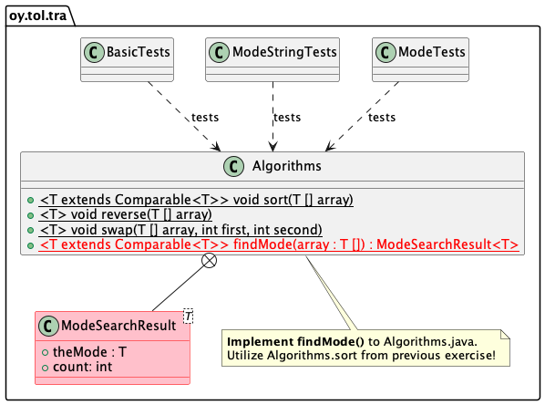

# Tyyppiarvo eli moodi

Tietorakenteet ja algoritmit | Data structures and algorithms.

## Harjoituksen tavoite

Harjoituksen tavoitteena on suunnitella ja toteuttaa algoritmi joka löytää tyyppiarvon eli moodin geneerisestä taulukosta.

Moodi eli tyyppiarvo on se luku jota löytyy joukosta numeroita eniten. Esimerkiksi lukujen `[3.0, 1.0, 2.0, 5.5, 3.0 ,3.0, 4.5, 1.0, 4.0, 4.5, 3.0, 5.5]` tyyppiarvo on `3.0` sillä sitä löytyy joukosta neljä kappaletta, muita vähemmän.

**Suunnittele ja toteuta geneerinen algoritmi** joka löytää annetusta taulukosta *tyyppiarvon*. 

> Huom: tarkoitus on selvitä tästä mahdollisimman vähällä lisämuistin käytöllä. Muutama lisämuuttuja pitäisi riittää, eikä tässä pitäisi luoda uusia taulukoita!

> Vinkki: lajittelu voi auttaa. Toteutit geneerisen lajittelualgoritmin harjoituksessa `01-arrays`, joten voit käyttää sitä ilman mitään muutoksia. Jos et pääse alkuun algoritmin suunnittelussa, hae apua harjoituksista!

**Kopioi siis** 01-arrays -harjoituksen `Algorithms.java` -tiedosto tämän harjoituksen lähdekooditiedostojen hakemistoon (`src/main/java/oy/tol/tra`) -- hakemistoa ei (välttämättä) ole valmiina, joten **tee se samalla**. Älä kopioi tiedostoa `src/test` -hakemiston alle, sinne kuuluvat vain testikoodi.

## Edeltävät vaatimukset

Sinulla on kaikki tarvittavat työkalut asennettuna ja olet testannut että ne toimivat. Tämä tehtiin harjoituksessa `00-init`. Jos et ole tehnyt sitä, tee se ensin, ja varmista että myös tätä edeltävä harjoitus `01-arrays` on tehty, koska tarvitset tämän harjoituksen geneeristä lajittelualgoritmia tässä tehtävässä.

## Ohjeet

**Toteuta** `Algorithms` -luokkaasi *geneerinen* metodi `Algorithms.findMode` siten että se löytää annetusta geneerisestä taulukosta tyyppiarvon. **Käytä** alla olevia metodien ja apuluokan esittelyjä koodin pohjaksi. Testit olettavat tällaiset rajapinnat, ja koodi ei käänny jos toteutuksesi ei ole *täsmälleen* samanlainen kuin alla.

Tarvitset `Algorithms` -luokan *sisälle* apuluokan (*inner class*) `ModeSearchResult`, joka palauttaa löydetyn tyyppiarvon ja sen yleisyyden (laskuri `count`):

```Java
   public static class ModeSearchResult<T> {
      public T theMode;
      public int count = 0;
   }

   public static <T extends Comparable<T>> ModeSearchResult<T> findMode(T [] array) {
      ModeSearchResult<T> result = new ModeSearchResult<>();
      // ...      
      return result;
   }
```
Huomaa että parametrina olevan taulukon elementtien on toteutettava `Comparable` -rajapinta -- moodin etsimisessä elementtejä on vertailtava toisiinsa.

Toteutuksesi **tulee huomioida** tilanteet joissa parametrina annettu taulukko on `null` tai taulukossa on niin vähän elementtejä että tyyppiarvoa ei voi määritellä. Näissä tilanteissa metodin palauttaman `ModeSearchResult.theMode`:n arvon täytyy olla `null` ja `ModeSearchResult.count`:n arvon tulee olla -1.

> Voit kuitenkin olettaa että taulukosta löytyy aina yksi arvo jota on enemmän kuin mitään muuta arvoa. Eli tyyppiarvo löytyy aina. Testiaineiston generointi huolehtii tästä. Toteutettavan algoritmin pitää kuitenkin löytää tyyppiarvo ja sen lukumäärän tulee olla oikea.

UML -luokkamalli alla näyttää tämän harjoituksen yleisrakenteen.



Toteutettavan metodin tulee palauttaa `ModeSearchResult` -olio, joka sisältää jäsenmuuttujissaan aineiston tyyppiarvon ja laskurin joka kertoo kuinka monta kertaa tyyppiarvo esiintyi taulukossa.

Testit kutsuvat toteutustasi ja tulostavat näkyviin mittauksia jotka osoittavat kauanko tyyppiarvon etsimisessä eri kokoisilla taulukoilla kesti.

## Testaus

Suorita **ensin** `BasicTests` -testin joka testaa toteutuksesi perusasiat:

```console
mvn -Dtest=BasicTests test
```

* taulukon ollessa null pitää palauttaa yllä mainittu tulos,
* taulukon sisältäessä liian vähän elementtejä moodin laskemiseksi, pitää palauttaa yllä mainittu tulos,
* testataan taulukolla [1,1], palauttaako koodi tuloksena että arvoa 1 löytyy kaksi kappaletta (on siis etsittävä moodi),
* testataan neljän elementin taulukoilla, löytyykö moodiarvo.

Jos perustestit menevät läpi, **suorita kaikki testit** jotta näet pääseekö toteutuksesi läpi testeistä joissa käytetään isoja taulukoita sekä `Double` että `String` -tyyppisiä olioita. Pääteikkunassa testit suoritetaan komennolla:

```
mvn test
```

Jos testit eivät mene läpi, näet virheilmoituksia. Muuten testit menevät läpi. Korjaa mahdolliset ongelmat toteutuksessasi ja yritä uudelleen. Älä muuta yksikkötestejä millään tavoin.

Huomaa että mitä isompi taulukosta tulee, sitä kauemmin sen käsittelyssä menee. Esimerkkitulostus opettajan koneelta:

```console
[INFO] Running oy.tol.tra.ModeStringTests
Testing findMode with Strings
Array size (n)	 time (ms)	Mode value found
      1000	        14	tira-mode
      2000	        14	tira-mode
...
     20000	      1522	tira-mode
     21000	      1682	tira-mode
     22000	      1838	tira-mode
     23000	      2047	tira-mode
     24000	      2224	tira-mode
     25000	      2437	tira-mode
Done!
[INFO] Tests run: 1, Failures: 0, Errors: 0, Skipped: 0, Time elapsed: 20.596 s - in oy.tol.tra.ModeStringTests
[INFO] Running oy.tol.tra.BasicTests
Testing basic functionality of implementation with small arrays.
[INFO] Tests run: 1, Failures: 0, Errors: 0, Skipped: 0, Time elapsed: 0.001 s - in oy.tol.tra.BasicTests
[INFO] Running oy.tol.tra.ModeTests
Testing findMode with Doubles
Array size (n)	 time (ms)	Mode value found
      1000	         7	674,00
      2000	        11	621,00
...
     25000	      1810	13864,00
Done!
[INFO] Tests run: 1, Failures: 0, Errors: 0, Skipped: 0, Time elapsed: 15.883 s - in oy.tol.tra.ModeTests
```

Kaksi testiluokkaa tekevät samaa asiaa, toinen `Double` -tyypin taulukoilla, toinen `String` taulukoilla. Keskity analyysissä vain toiseen näistä (`ModeTests`), toisen tarkoitus on vain varmistaa että algoritmisi on varmasti geneerinen eli toimii eri tyyppisten taulukoiden kanssa. ModeTests sisältää myös todella yksinkertaisia pieniä taulukoita käyttäviä testejä. Jos toteutuksessa on jotain vikaa, voit aluksi keskittyä suorittamaan 

**Kopioi** testien tuloste ja vie se taulukkolaskinsovellukseen, kuten Excel, Google Sheets, OpenOffice spreadsheet tai Applen Numbers jonka saa macOS:ään.

**Kun olet kopioinut tulosteen** lisää taulukkolaskinsovellukseen viivadiagrammi, jonka avulla voit verrata visuaalisesti eri mittauksia toisiinsa suhteessa syötteen kokoon.

**Analysoi** koodisi aikatehokkuutta eli suoritusaikaa diagrammin muihin mittauksiin ja niistä piirrettyihin viivadiagrammeihin. Tarkastele myös numeerisia arvoja ja kysy itseltäsi mikä mahtaa olla toteutuksen aikakompleksisuusluokka? **Tutki** koodiasi ja mieti mikä on koodisi aikakompleksisuus? Huomioi kaikki mitä tehdään `findMode` -metodin sisällä, mukaan lukien muut kutsuttavat omat metodisi. Mikä on tämän perusteella koodisi aikakompleksisuus? Miten se suhteutuu graafiseen esitykseen suoritusajoista n:n koon kasvaessa?

**Kirjaa** näiden analyysien pohdinta repon juurihakemistossa valmiina olevaan raporttitiedostoon (`REPORT.md`) harjoituksen 02-mode -kohdalle. Lisää myös **kuvakaappaus** taulukkolaskinohjelman graafista kuvatiedostona ja tee linkki kuvatiedostoon Markdown -formaatilla. Mallin tähän saat tästä dokumentista ja sen UML-diagrammikuvan sijoittamisestta dokumenttiin.

## Palautus

**Muista** lisätä tämän harjoituksen `Algorithms.java` tiedosto git:iin komennolla `git add`, muuten se ei siirry etärepositoryysi.

**Lisää raportti ja kuvatiedosto** jossa graafi, git:iin komennolla `git add` / `git commit`. 

Palauta valmis tehtävä kuten kurssilla on opastettu. Käytä git:n komentoja viemään toteutuksesi ensin paikalliseen koneesi repositoryyn ja sitten omaan privaattiin etärepositoryysi komennolla `git push`.

## Ongelmia, kysymyksiä?

Osallistu kurssin luennoille, harjoituksiin ja verkkofoorumeille, kysy apua ja ohjeita.

Jos sinulla on ongelmia työkalujen kanssa, varmista että sinulla on oikea JDK asennettuna ja käyttöjärjestelmäsi ympäristömuuttujat (environment variables, `PATH` ja `JAVA_HOME`) osoittavat oikeaan JDK:n hakemistoon. Varmista että Maven on myös asennettu oikein ja git toimii.

## Tietoja

* Kurssimateriaalia Tietorakenteet ja algoritmit -kurssille | Data structures and algorithms 2021-2022.
* Tietojenkäsittelytieteet, Tieto- ja sähkötekniikan tiedekunta, Oulun yliopisto.
* (c) Antti Juustila 2021-2022, INTERACT Research Group.
