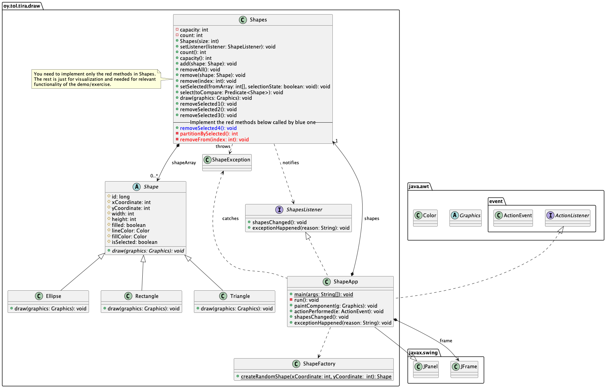

# 03-draw

Data structures and algorithms exercise.

## The goal

* The goal of the exercise is to learn how to **partition** an array.
* Partition is used to divide a set into partitions, usually two. This can be used for different purposes, for example in sorting algorithms.
* In this exercise you implement partitioning to quickly remove a selected subset of elements from an array.

The exercise includes a step by step process of the learning goal. The actual implementation to program is relatively small exercise.

Remember that you do not need to understand how this Java Swing GUI app works. Just focus on the actual learning goal and subject of the exercise.

## Prerequisites

You have done the predecing exercises. You havel also **participated the demonstration** of this exercise, either live at lectures or by looking at the demo video. These can be found from the course Moodle wordspace.

**Copy** the `Algorithms.java` file from the exercise `02-mode` to this exercise source code directory. You can use algorithm(s) from that class in implementing this exercise.

## Instructions

The UML class diagram below shows the classes of this exercise. You will only implement the methods in red color in the `Shapes` class. The course demo explains the structure of the app and the roles of the classes in the structure and behaviour of the application.



Study the code given. Launch the app from the `ShapeApp` class `main` method and continue following the instructions below.

### Removing one object

From the app menu, execute the command **Create 18 shapes**. See how the creation of the objects in the array is animated.

Execute the command **Remove 1 from middle**. One element is removed from the middle of the array. 

See that the objects after the removed one are moved to the left, filling the gap left by the removed object.

An important property of the array here is that even though elements are removed from the middle, the array is kept "whole" -- between the indexes `0..<array.size` there exists only valid shape objects, no null references. This simplifies the handling of the array and makes it faster. Code is able to always assume that indexes `0..<array.size` always have valid `Shape` objects. 

The moving of elements after the removed one is done in the `Shapes.remove()` method. It takes care of moving the objects after the removed one. You do not need to touch this method in this exercise.

Let's move on

### Removing several objects - algorithm 1

In this and the next steps, several objects are always moved from the array; all the red selected drawing elements.

In the app (in `ShapeApp.actionPerformed()`) the remove menu commands are handled like this:

```Java
shapes.select(shape -> shape.getLineColor() == Color.RED);
shapes.removeSelected1();
```
So: first select all the red shape elements, and then remove those. `Shapes` class has several removeSelectedX methods we will take a look at, one by one.

But before continuing ahead, **think how you** would implement a method that removes all selected shapes from the array. Maybe using a for loop? Going through all the elements from the beginning of the array, and then remove each selected shape from the array index by calling `Shapes.remove(int)`. Or something else?

*(...hopefully here you will spend some time thinking how to do this...)*

---

Next:

1. Execute the menu command **Create 18 shapes** and wait it to finish. 
2. Execute the menu command **Remove red shapes algo 1**. 

You will see an issue (`NullPointerException`) and console has a stack trace printed out.

This is because this algorithm *is not a good implementation* to remove the selected elements:

```Java 
    public void removeSelected1() throws ArrayIndexOutOfBoundsException, InterruptedException {
        // 1st bad way, crashes since index out of bounds.
        int endIndex = count();
        for (int index = 0; index < endIndex; index++) {
            if (shapeArray[index].isSelected()) {
                remove(index);
            }
        }
    }
```
So:

1. take the count of elements to a temporary variable,
2. go through the indexes from the beginning to that temporary count of elements,
3.   for each element, if the shape is selected, remove it.

The problem here is the step 1. When `remove(int)` removes the element, it moves the rest of the elements down the array. When this is done several times, the array indices at the end part become null. But the loop uses the "old" count and goes past the new end of the array, handling those null elements. Thus the `NullPointerException`.

So this is no good. Next we try something better.

### Solving previous issue - algorithm 2

The implementation above did not consider that the count of elements changes when some are moved from the array.

This is why the implementation version 2 below. Choose again the menu command **Create 18 shapes** and wait for the array to be filled.

After this, execute the menu command **Remove red shapes algo 2**. Now you should not see any issues.

```Java
    public void removeSelected2() throws ArrayIndexOutOfBoundsException, InterruptedException {
        // 2nd bad way
        for (int index = 0; index < count; index++) {
            if (null != shapeArray[index] && shapeArray[index].isSelected()) {
                remove(index);
                index--;
            }
        }
    }
```

This implementation avoids three issues in the first implementation:

1. this one does not use any local variable but uses the `count` member variable -- the `Shapes.remove()` updates the count member variable whenever removing elements from the array. So this algorithms is always up to date about the count of objects to handle.
2. the if condition checks that the element is not null before checking if the element is selected to be removed -- no null pointer exception.
3. if the element is removed, the index counter is decremented by one. Without this, loop would jump over the element that was just removed from the current index as following elements are moved down replacing the current removed element!

Now it looks like verything works just wonderfully? Not so, unfortunately.

Choose the menu command **Create 10 000 shapes** and after that, the command **Remove red shapes algo 2**.

Removal happens pretty fast. But try and choose the command **Create 100 000 shapes** and then **Remove red shapes algo 2**.

Now the removal takes very much too long a time. Too long to be used in an interactive graphical app, for example a game. The algorithm is correct, but the time complexity is quite bad.

The next alternative implementation #3 solves the problem -- at least partially.

### Make previous algorithm faster - algorithm 3

One of the issues in the previous algorithm is that it advances the array from the beginning to the end. When an element is removed, *all* the elements after that will be moved one step down. Also those elements that will be later removed. No use moving anything that would be later removed anyways, yes!?

So lots of unnecessary work is done. Instead traversing the array from the beginning to the end, should it be traversed *from the end to the beginning*? This way, only those elements already removed from the end are moved towards the beginning. Elements to be removed are not moved at all.

This is how the third implementation works:

```Java
    public void removeSelected3() throws ArrayIndexOutOfBoundsException, InterruptedException {
        // 3rd works, but...
        for (int index = count - 1; index >= 0; index--) {
            if (shapeArray[index].isSelected()) {
                remove(index);
            }
        }
    }
```
So: starting from the end of the array towards the beginning, remove elements, while moving only those shapes kept in the array towards the beginning. You probably have learned traversing arrays from index 0 towards the end. That is not always the best or even the right way, however.

Try out how these two algorithms can handle an array with 100 000 elements. Note that the app prints out to the console the **execution time** of both implementations. On my computer, the algorithm traversing from the end of array to the beginning executes about in 50% of the time the beginning to the end algorithm takes to execute:

```console
removeSelected2 took 4413 ms
removeSelected3 took 2186 ms
```

This is significant improvement in speed, cutting the execution time **to half**!

But still, this over two seconds of time is is still *too much*. If a game app would let the user to wait two seconds while large number of polygons would be removed, this would be unbearable. This is why we will strive to even faster algorithm...

### Partitioning and then removing from end - algorithm 4

Through the previous algorithms we have seen that a lot of time is spend in keeping the shapes in the array in one contiguous area and move the shape elements towards the beginning replacing the gaps left by removed elements.

This is something we want to keep. For example, if we create large number of elements and then quite a many of those are removed, we can - after removing the elements - make the array smaller. This way the memory used for the null elements can be freed to other purposes. So we will continue with this implementation style.

The algorithm 3 is still slow since it needs to move elements. For example, in an array of 50 000 elements we remove some from the middle. We then need to move about 25 000 elements down one at a time, repeatedly until the job has been done.

Would there be a more faster way to do this?

One of those faster ways is to use **partitioning**. Even though the algorithm below seems at first a bit complicated, the speed is excellent compared to the algorithm 3. On my computer:

```console
removeSelected2 took 4413 ms
removeSelected3 took 2186 ms
removeSelected4 took 10 ms
```
So the speed of the algorithm 4 based on partitioning is 1/218th of the algorithm 3. **Huge improvement!** This kind of an algorithm can actually be used, for example, in game programming when large number of graphic elements like shapes need to be removed when they are no longer needed. For example, when a game object is no longer needed (the object was removed or not anymore visible in the player's view).

The principle of partitioning is as follows. In the example array below, imagine that the elements marked with x are removed, while other elements are left in the table:

The array before partitioning, elements d, h, l o, p and q are marked to be removed:

```
size: 24, length 24
value:  a  b  c  d  e  f  g  h  i  j  k  l  m  n  o  p  q  r  s  t  u  v  w  z
index:  0  1  2  3  4  5  6  7  8  9  10 11 12 13 14 15 16 17 18 19 20 21 22 23
remove:          x           x           x        x  x  x
```

The array after partitioning:

```
size: 24, length 24
value:  a  b  c  e  f  g  i  j  k  m  n  r  s  t  u  v  w  z  d  h  l  o  p  q
index:  0  1  2  3  4  5  6  7  8  9  10 11 12 13 14 15 16 17 18 19 20 21 22 23
remove:                                                       x  x  x  x  x  x
```

Partitioning means to divide the array contents into two *parts*. The elements to be removed are moved to the other side of the array, while the other side contains the elements not to be removed. In this example, the index 18 is the partitioning index.

The speed advantage of partitioning comes from the fact that now it is easy to remove all the elements at and after the partitioning index 18. Since there are no elements to keep after the index 18, there is *no need to move elements down the array* but they can simply be removed by assinging null to the array indices in a simple for loop:

```
size: 18, length 24
value:  a  b  c  e  f  g  i  j  k  m  n  r  s  t  u  v  w  z  __ __ __ __ __ __
index:  0  1  2  3  4  5  6  7  8  9  10 11 12 13 14 15 16 17 18 19 20 21 22 23
remove:                                                       
```

As a bonus, if we want to free the memory held by the array to other purposes, just decrease the size of the array after removal of the elements:

```
size: 18, length 18
value:  a  b  c  e  f  g  i  j  k  m  n  r  s  t  u  v  w  z
index:  0  1  2  3  4  5  6  7  8  9  10 11 12 13 14 15 16 17
remove:                                                       
```

And after this, all the memory from index 18 would be free.

As you can see, the logic of the partitioning is simple. The algorithm that does this is not too complicated either. Below you will find instructions on how **you will implement partitioning**.

## Instructions for implementing algorithm 4

You will next implement partitioning **as a generic algorithm** and removing elements after partitioning. Why generic? Because in a later task, you will also need partitioning. Implementing it now as a generic algorithm enables you later to use this one, instead of implementing it again from scratch. Neat!

The logic at high level can be found in the code already:

```Java
    public void removeSelected4() {
        // int selectedIndex = Algorithms.partitionByRule(shapeArray, count, shape -> shape.isSelected());
        removeFrom(indexToSelected);
    }
```
Your task is to implement two methods, first one in your `Algorithms` class (you need to copy from the previous exercise!), and another one in the `Shapes` class:

1. `public static <T> int partitionByRule(T [] array, int count, Predicate<T> rule)` -- partition the array so that the elements conforming the predicate in the array are moved forward in the array. In the end, all elements conforming to the predicate must be at the end of the table. The method will return the index where the first conforming element is. If no conforming elements are found, the method will return the count of elements in the array.
2. `removeFrom(int indexToSelected)` -- remove all elements from the array starting from this index, by assinging null to the array indices. If the method `partitionBySelected()` returned the count of elements in the array, this method does nothing, practically. Remember, at the end, to update the count of elements in the array to the `count` member variable of the `Shapes` class.

You can find an example on how to use the Java `Predicate`, implemented in `Shapes.select(Predicate<Shape> toCompare)` and that method called in `ShapeApp.actionPerformed()`. More about [Predicate in Java docs](https://docs.oracle.com/en/java/javase/15/docs/api/java.base/java/util/function/Predicate.html).

Remember to remove the comment chars before the call to your partitioning algorithm, when you have it implemented.

The second of these algorithms is a trivial for loop. The first goes roughly like this, shown in pseudocode:

```
Input:  An array with items, some conforming to the predicate.
Output: Partitioned array, items conforming to the predicate at the end.
        Returns: the index of the first item conforming to the predicate.

index = search the index of the first element conforming to the predicate in the array
if index >= count
   return count // no conforming elements in the array, return the end
nextIndex = index + 1
while nextIndex < count
   if array[nextIndex] is not conforming
      swap(array, index, nextIndex) // use your Algorithms.swap!
      index = index + 1 // index has now element not conforming to predicate, so move forward to next index
   nextIndex++ // find the next not conforming to predicate
return index
```

So the algorithm searches (from the beginning) for the first *conforming* element and after that *not conforming* elements, and then swaps their places. When traversing the array like this, all not conforiming elements move backwards in the array. And obviously the conforming elements are moved forward towards the end of the array. Remember that you most probably already implemented the swapping as a generic method in your `Algorithms` class in the exercise `01-arrays`, so you can use that, as hinted above in the pseudocode. If you yet have not implemented a generic swap method for arrays, do that now in the `Algorithms` class - you have use for that later in the course too!

> **Consider** the time complexity of the algorithm above? This is something that we could ask in the **course exams**!

## Testing

Test the implementation of your algorithm from the command line:

```console
mvn test
````
or from VS Code. Especially note the output from the app:

```console
Running oy.tol.tra.ShapeArrayTests
****==-- Method 3 --==****
Adding 100000 shapes took 6 ms
Marking 50000 shapes as selected took 4 ms
Removing 50000 selected shapes took 2472 ms
****==-- Method 4 -=- YOUR STUFF HERE --==****
Adding 100000 shapes took 6 ms
Marking 50000 shapes as selected took 1 ms
Removing 50000 selected shapes took 8 ms
```

Method 4 ("YOUR STUFF HERE") is *your* implementation speed. As you can see from this example output, your implementation should be very, very much faster than Method 3 speed. If this is not the case, your implementation needs to be improved.

When tests pass, **try out your implementation** also in the **graphical user interface**. Create 100 000 shpaes from the menu and then use your algorithm to remove all red shapes. Compare visually the performance against algorithm 3 -- can you also see the difference from the user's perspective?

## Delivery

When you have tested that your implementation of algorithm 4 works fast, you can deliver this exercise following the course instructions.

## Issues, questions?

Participate in the course lectures, exercise and online course forums, ask help and instructions.

If you have any issues with the tools, make sure you have the correct JDK installed and in use, and the environment variables (PATH and JAVA_HOME) point to the correct JDK directories. Make sure Maven has been correctly installed and git works too.

## About

* Data structures and algorithms 2021-2022.
* Information Processing Science, Faculty of Information Technology and Electrical Engineerin, University of Oulu.
* (c) Antti Juustila 2021-2022, INTERACT Research Group.