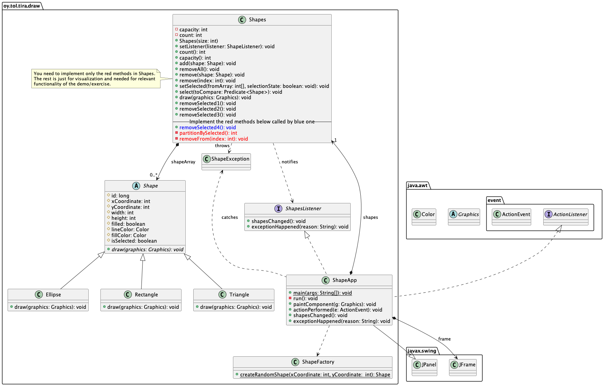

# 03-draw

Tietorakenteet ja algoritmit.

## Harjoituksen tavoite

* Harjoituksen tavoitteena on opetella tietojoukon (tässä tapauksessa taulukko) **osittaminen eli partitiointi**.
* Partitiointia käytetään tietojoukon jakamiseen kahteen osajoukkoon. Osittamista voidaan käyttää eri tarkoituksiin, esimerkiksi eri lajittelualgoritmeissa.
* Tässä harjoituksessa toteutat osittamisen jonka avulla voidaan nopeasti poistaa valittu osajoukko koko joukosta.

Harjoitus sisältää vaiheittaisen selityksen harjoituksen oppimasta. Itse ohjelmoitava osuus on tässä suhteellisen pieni.

Muista myös ettei sinun tarvitse ymmärtää miten tämä Java Swingillä toteutettu käyttöliittymä toimii. Keskity vaan harjoituksen aiheeseen. Paikka johon sinun tulee toteuttaa koodia on osoitettu alla olevassa harjoituksen sovelluksen luokkamallissa.


## Edeltävät tehtävät

Olet tehnyt edeltävät harjoitukset. Olet myös katsonut harjoitukseen liittyvän **demoluennon** joko livenä tai tallenteelta. Tämä löytyy kurssin aikataulusta ja Moodlesta (tallenne).

**Kopioi** `02-mode` -harjoituksen `Algorithms.java` -tiedosto tämän harjoituksen lähdekooditiedostojen joukkoon. Voit käyttää tästä luokasta hyödyksesi edellisessä harjoituksessa toteuttamiasi algoritmeja.

## Ohjeet

UML -luokkamalli alla kuvaa tämän harjoituksen entiteetit. Tulet toteuttamaan vain kuvassa punaisella osoitetut metodit `Shapes` -luokassa. Kurssin demo selittää tarkemmin sovelluksen rakenteen ja eri luokkien roolin sovelluksen rakenteessa ja käyttäytymisessä.



Tutki valmiina annetun koodin toimintaa. Käynnistä ohjelma `ShapeApp` -luokan `main` -metodista ja jatka alla olevien ohjeiden mukaisesti eteenpäin.

### Yhden olion poistaminen

1. Suorita valikosta komento **Create 18 shapes**. Huomaa miten taulukon luonti animoidaan. Odota animaation loppumista.
2. Suorita valikosta komento **Remove 1 from middle**. Taulukosta poistetaan keskeltä yksi elementti. Odota taas animaation loppumista.

Huomaa että puolivälin toiselta puolelta elementit siirtyvät yhden pykälän vasemmalle täyttäen poistetun elementin jättämän "aukon".

Tässä taulukon tärkeä ja hyödyllinen omaisuus on se, että vaikka elementtejä poistetaan keskeltäkin, taulukko pidetään "ehyenä" -- välillä `0..<array.size` on vain olioita, ei null -viittauksia. Näin taulukon käsittely on yksinkertaista ja nopeaa: koodissa voidaan aina olettaa että indeksien `0..<array.size` välillä on aina valideja `Shape` -olioita. 

Tämä poistetun jälkeen tulevien elementtien siirtäminen tapahtuu `Shapes.remove()` -metodeissa. Se huolehtii siitä että kun väleistä poistetaan `Shape` -olioita, sen jälkeen tulevat siirtyvät kaikki pykälän vasemmalle. Tähän metodiin sinun ei tarvitse koskea.

Jatketaan eteenpäin.

### Usean olion poistaminen - algoritmi 1

Tässä ja seuraavissa vaiheissa taulukosta poistetaan aina useita olioita; kaikki valitut (harmaat) piirroselementit.

Ohjelmassa (`ShapeApp.actionPerformed()`) poista -valikkokomentoja käsitellään näin:

```Java
shapes.select(shape -> shape.getLineColor() == Color.GRAY);
shapes.removeSelected1();
```
Eli: ensin valitaan kaikki harmaat Shape -oliot ja sen jälkeen ne poistetaan. `Shapes` -luokassa on useita removeSelectedX -metodeja joihin tutustutaan yksi kerrallaan.

Mutta ennen kuin jatkat, **mieti miten itse** toteuttaisit metodin joka poistaa taulukosta kaikki valitut piirroselementit. Ottaen huomioon että poistamismetodi `Shapes.remove` aina poistaa elementin taulukosta saman tien. Kenties -for -silmukalla...? Käytäisiin vaikka läpi elementit alusta loppuun ja poistetaan kaikki valitut shapet yksi kerrallaan taulukosta kutsumalla `Shapes.remove(int)` metodia? Vai jotain muuta?

*(...tässä välissä toivottavasti paljon pohdintaa kynän ja paperin kanssa...)*

---

Seuraavaksi:

1. Suorita valikosta komento **Create 18 shapes** ja odota että taulukko on luotu. 
2. Suorita valikosta komento **Remove red shapes algo 1**. 

Huomaat että ohjelmassa tulee virheilmoitus (`NullPointerException`) ja konsoliin tulostuu call stack.

Tämä johtuu *huonosti toteutetusta* algoritmista joka poistaa valitut elementit näin:

```Java 
    public void removeSelected1() throws ArrayIndexOutOfBoundsException, InterruptedException {
        // 1st bad way, crashes since index out of bounds.
        int endIndex = count();
        for (int index = 0; index < endIndex; index++) {
            if (shapeArray[index].isSelected()) {
                remove(index);
            }
        }
    }
```
Eli:

1. otetaan tilapäiseen muuttujaan elementtien määrä,
2. käydään indeksit läpi alusta loppuun eli elementtien määrän verran,
3.   jos shape-elementti on valittu, poistetaan se.

Ongelma tässä on askel 1. Kun `remove(int)` poistaa elementin ja siirtää muita alkuun päin, ja näitä poistetaan useita, loppupäässä olevien elementtien tilalle on tullut null. Silmukka etenee kuitenkin "vanhaan" taulukon loppuindeksiin asti jossa ei enää ole muuta kuin null -elementtejä. Tästä johtuu `NullPointerException`.

Eli tämä ei kelpaa. Olisitko tehnyt tämän virheen itse?

Seuraavaksi yritetään jotain parempaa.

### Edellisen ongelman ratkaisu - algoritmi 2

Edellinen toteutus ei siis ottanut huomioon sitä että elementtien määräkin muuttuu kun niitä poistetaan.

Siksi toteutusvaihtoehto 2 alla. Valitse taas valikosta komento **Create 18 shapes** ja odota että taulukko on täytetty. 

Sen jälkeen, suorita valikosta komento **Remove red shapes algo 2**. Nyt ei pitäisi tulla ongelmia.

```Java
    public void removeSelected2() throws ArrayIndexOutOfBoundsException, InterruptedException {
        // 2nd bad way
        for (int index = 0; index < count; index++) {
            if (null != shapeArray[index] && shapeArray[index].isSelected()) {
                remove(index);
                index--;
            }
        }
    }
```

Tässä vältetään kolme ongelmaa jotka olivat ensimmäisessä toteutuksessa:

1. nyt ei oteta elementtien lukumäärää paikalliseen muuttujaan joka ei päivity elementtejä poistettaessa, vaan käytetään jäsenmuuttujaa `count` -- `Shapes.remove()` päivittää sitä aina poistaessaa elementin. Ei mennä laskuissa sekaisin siitä, montako elementtiä taulukossa on.
2. if -lauseessa tarkistetaan, ettei elementti vaan ole null ennenkuin mennään katsomaan onko se valittu poistettavaksi -- ei tule null pointer exceptionia.
3. jos elementti poistetaan, index -laskurin arvoa vähennetään yhdellä. Muuten hypättäisiin sen elementin yli, joka siirrettiin taulukossa alkuun päin, nyt poistetun elementin tilalle!

Näyttäisi siltä että kaikki toimii erinomaisen hyvin? Ei ihan kuitenkaan.

Valitse valikosta komento **Create 10 000 shapes** ja sen jälkeen komento **Remove red shapes algo 2**.

Poistaminen tapahtuu aika sukkelaan. Mutta valitsepa komento **Create 100 000 shapes** ja sen jälkeen komento **Remove red shapes algo 2**.

Nyt poistaminen kestää kauan. Aivan liian kauan interaktiivisen graafisen ohjelman (esim. peli) tarpeisiin. Eli algoritmi on oikeellinen mutta aikakompleksisuudeltaan huono.

Tämä ongelma ratkaistaan (ainakin jossain määrin) seuraavaksi.

### Nopeutetaan poistamista - algoritmi 3

Edellisen ratkaisun ongelma oli osin siinä, että silmukka etenee `Shape` -taulukon *alusta loppuun*. Välillä kun poistetaan valittuja olioita, *kaikki* myöhemmin tulevat oliot siirretään pykälä taulukon alkuun päin. Myös ne elementit jotka tullaan poistamaan myöhemmin. Eihän niitä kannattaisi siirrellä kun ne poistetaan kuitenkin myöhemmin?!

Tässä tehdään siis paljon turhaa työtä. Kannattaisiko sen sijaan edetä taulukon *lopusta alkuun päin*? Näin siirretään lopusta alkuun vain niitä elementtejä jotka on päätetty pitää taulukossa, eikä siirrellä poistettavia elementtejä.

Näin toimii kolmas toteutus:

```Java
    public void removeSelected3() throws ArrayIndexOutOfBoundsException, InterruptedException {
        // 3rd works, but...
        for (int index = count - 1; index >= 0; index--) {
            if (shapeArray[index].isSelected()) {
                remove(index);
            }
        }
    }
```

Eli lähdetään liikkeelle lopusta ja edetään alkuun päin, poistaen elementtejä ja siirtäen vain taulukossa pidettäviä elementtejä alkuun päin. Vaikka olet oppinut tyypillisesti perusohjelmointikursseilla käymään läpi taulukoita ja muita tietosäiliöitä alusta loppuun, *se ei aina ole se paras tai edes oikea vaihtoehto*.

Kokeile miten nämä kaksi toteutusta selviävät 100 000 elementin taulukosta. Huomaa että ohjelma tulostaa terminaaliin molempien toteutusten **suoritusajan**. Omalla koneellani lopusta alkuun -toteutus on n 50% alusta loppuun -toteutuksen suoritusajasta:

```console
removeSelected2 took 4413 ms
removeSelected3 took 2186 ms
```

Eli merkittävä suoritusnopeuden parannus, **puolet pois**!

Silti, tuo reilun kahden sekunnin suoritusaika on vieläkin *liian paljon*. Jos esimerkiksi pelisovellus odotuttaisi käyttäjäänsä kaksi sekuntia kun poistetaan suuria määriä polygoneja eli pelihahmojen graafisia elementtejä, tämä olisi täysin sietämätön tilanne. Siksi etenemme kohti parempaa toteutusta...

### Partitointi ja poistaminen lopusta - algoritmi 4

Edeltävien ratkaisujen kautta on nähty että paljon aikaa menee siihen että halutaan pitää shape -oliot taulukossa peräkkäin ja siirrellään jäljempänä olevia shape -olioita alaspäin poistettujen tilalle.

Tästä on omat hyötynsä joten siitä ei kannata luopua. Esim. jos shapeja luodaan vaikka tuo 100 000 ja poistetaan niistä puolet, voitaisiin samalla tiivistää poistamisen jälkeen taulukon kokoa. Näin saadaan vapautettua muistia muuhun käyttöön. Eli jatkamme tällä periaatteella.

Vaiheen 3 toteutuksessa on siinäkin vielä hitautensa. Kun taulukkoa on edetty lopusta alkuun, ja poistetaan vaikka jäljellä olevista 50 000 elementistä keskimmäinen, tästä loppuun päin olevat n 25 000 elementtiä pitää silti siirtää yksi kerrallaan alkuun päin, jokaisella poistokerralla aina uudestaan ja uudestaan jokaisen poiston yhteydessä.

Mikä olisi järkevämpi tapa?

Vastaus (tai yksi sellainen) on **partitiointi** eli **osittaminen**. Vaikka algoritmi alla vaikuttaa ehkä monimutkaiselta, sen suoritusnopeus on erinomainen verrattuna tapaan 3 edellä. Omalla koneellani:

```console
removeSelected2 took 4413 ms
removeSelected3 took 2186 ms
removeSelected4 took 10 ms
```
Partitiointin perustuva toteutus on 1/218 edellisen kolmosvaiheen suoritusnopeudesta. **Huikea parannus!** Tällaista algoritmia voi käyttää peliohjelmoinnissakin kun muistista täytyy poistaa sellaisia grafiikkaprimitiivejä joita ei enää tarvita (pelihahmo poistui pelistä tai näkyvistä).

Osittamisen periaate tässä tapauksessa on seuraava. Alla esimerkkitaulukossa kuvitellaan että x:llä merkityt elementit poistetaan ja muut jäävät taulukkoon:

Taulukko ennen partitiointia, elementit d, h, l o, p ja q merkitty poistettavaksi:

```
koko: 24, pituus 24
arvo:   a  b  c  d  e  f  g  h  i  j  k  l  m  n  o  p  q  r  s  t  u  v  w  z
index:  0  1  2  3  4  5  6  7  8  9  10 11 12 13 14 15 16 17 18 19 20 21 22 23
poisto:          x           x           x        x  x  x
```

Ja taulukko partitioinnin jälkeen:

```
koko: 24, pituus 24
arvo:   a  b  c  e  f  g  i  j  k  m  n  r  s  t  u  v  w  z  d  h  l  o  p  q
index:  0  1  2  3  4  5  6  7  8  9  10 11 12 13 14 15 16 17 18 19 20 21 22 23
poisto:                                                       x  x  x  x  x  x
```

Partitiointi tarkoittaa siis osittamista. Taulukon sisältö ositetaan eli jaetaan kahteen *osaan*: toiselle puolelle taulukkoa (loppuun) siirretään poistettavat elementit, toiselle puolelle (alkuun) säilytettävät elementit. Tässä tapauksessa indeksi 18 osoittaa jakokohdan - sitä ennen säilytettävät oliot, sen jälkeen poistettavat oliot.

Partitioinnin nopeusetu tulee tästä. Nyt on helppo poistaa kaikki elementit indeksistä 18 alkaen. Ja koska loppupäässä ei ole muita kuin poistettavia elementtejä, näitä *poistettavia ei tarvitse enää siirrellä* taulukossa alkuun päin, vaan ne merkitään kaikki null:ksi yksinkertaisessa for-silmukassa:

```
koko: 18, pituus 24
arvo:   a  b  c  e  f  g  i  j  k  m  n  r  s  t  u  v  w  z  __ __ __ __ __ __
index:  0  1  2  3  4  5  6  7  8  9  10 11 12 13 14 15 16 17 18 19 20 21 22 23
poisto:                                                       
```

Bonuksena, jos haluttaisiin vapauttaa sovelluksen käyttämää muistia muuhun tarkoitukseen, voitaisiin poistamisen jälkeen taulukon kokoa pienentää:

```
koko: 18, pituus 18
arvo:   a  b  c  e  f  g  i  j  k  m  n  r  s  t  u  v  w  z
index:  0  1  2  3  4  5  6  7  8  9  10 11 12 13 14 15 16 17
poisto:                                                       
```

Ja käyttää vapautunut muisti (indeksistä 18 eteepäin muisti on vapaana) muuhun tarkoitukseen.

Partitioinnin logiikka on siis yksinkertainen. Algoritmikaan ei ole kovin monimutkainen. Alla karkea kuvaus siitä **miten toteutat partitioinnin** tämän harjoituksen ohjelmointitehtävänä.

## Ohjeet algoritmin 4 toteutukselle

Toteutat tässä itse partitioinnin ja poistamisen **geneerisenä algoritmina**. Miksi geneerisenä? Siksi että tarvitsemme partitiointialgoritmia myös myöhemmässä tehtävässä, joten silloin sitä ei tarvitse enää uudestaan toteuttaa. Kätevää!

Logiikka karkealla tasolla on jo valmiina koodissa:

```Java
    public void removeSelected4() {
        // int selectedIndex = Algorithms.partitionByRule(shapeArray, count, shape -> shape.isSelected());
        // removeFrom(selectedIndex);
    }
```
Tehtäväsi on toteuttaa kaksi metodia, ensimmäinen omaan `Algorithms` -luokkaasi jonka **kopioit** edellisestä harjoituksesta tämän harjoituksen lähdekooditiedostojen joukkoon. Toinen algoritmi `removeFrom` tulee tähän `Shapes` -luokkaan:

1. Lisää metodi `public static <T> int partitionByRule(T [] array, int count, Predicate<T> rule)` luokkaan `Algorithms` -- osita taulukko siten että siirrät predikaatin ehdon mukaiset elementit taulukossa eteenpäin niin että lopuksi nämä elementit ovat taulukon lopussa. Metodi palauttaa indeksin jossa ensimmäinen predikaatin ehdon täyttävä elementti on. Jos ehdon täyttäviä elementtejä ei löydy, metodi palauttaa taulukon elementtien lukumäärän.
2. Lisää `Shapes` -luokkaan metodi `removeFrom(int indexToSelected)` -- poista kaikki elementit taulukosta ko. indeksistä eteenpäin, sijoittamalla indekseihin null. Jos `partitionByRule()` palautti elementtien lukumäärän, tällä oleva silmukka ei käytännössä tee mitään, koska mitään ei tarvitse tehdä. **Muista** myös lopuksi päivittää taulukossa olevien elementtien lukumäärä `Shapes` -luokan `count` -jäsenmuuttujaan.

Javan `Predicate`:n käyttämisestä löydät esimerkin `Shapes.select(Predicate<Shape> toCompare)` -metodissa ja sen kutsun esimerkki löytyy esimerkkejä `ShapeApp.actionPerformed()` metodista. Tutustu tarkemmin [Predicate -luokkaan ja sen metodeihin Java -dokumentaatiosta](https://docs.oracle.com/en/java/javase/15/docs/api/java.base/java/util/function/Predicate.html). Jos `Predicate` tuntuu hankalalta, harjoituksissa käydään sitä esimerkinomaisesti läpi kun harjoitus on ajankohtainen.

Metodissa `removeSelected4()` on valmiina kutsu `Algorithms.partitionByRule` -metodiin mutta kommentoituna. Muista ottaa kommentit pois algoritmin kutsun kohdalta kun olet toteuttanut sen.

Jälkimmäinen algoritmeista on siis triviaali for -silmukka. Ensimmäinen algoritmi etenee karkeasti ottaen näin, pseudokoodina:

```
Input:  Taulukko jossa osa elementeistä täyttää predikaatin ehdon.
Output: Ositettu taulukko, predikaatin ehdon mukaiset elementit taulukon lopussa.
        Palauttaa: ensimmäisen predikaatin mukaisen elementin indeksin.
        
index = etsi ensimmäisen ehdon mukaisen elementin indeksi input -taulukossa (for-silmukka)
if index >= count
   return count // ei ehdon mukaisia elementtejä, palauta elementtien lukumäärä
// Etsitään seuraavasta elementistä eteenpäin...
nextIndex = index + 1
while nextIndex < count
   if array[nextIndex] ei täytä ehtoa
      // Vaihdetaan elementtien paikat
      swap(array, index, nextIndex) // käytä Algorithms.swap jonka toteutit jo!
      // index sisältää nyt elementin joka ei täytä ehtoa, joten siirry eteenpäin seuraavaan 
      index = index + 1 indeksiin.
   nextIndex++ // etsi seuraava ehdon mukainen elementti
return index
```

Eli käytännössä etsitään (taulukon alusta) ensimmäinen *ehdon mukainen elementti ja sen jälkeen *elementit jotka eivät täytä ehtoa* vaihdetaan (swap) näiden paikalle. Kun näin edetään, kaikki *ei ehdon mukaiset* elementit siirtyvät taulukossa taaksepäin muiden tilalle. Ja tietysti *ehdon mukaiset* eteenpäin kohti taulukon loppua. 

Muista että toteutit jo todennäköisesti swap -metodin geneerisenä luokkaan `Algorithms` harjoituksessa `01-arrays`, joten voit tässä käyttää sitä kuten pseudokoodissa yllä vinkataan. Jos et ole tätä vielä toteuttanut, toteuta se nyt `Algorithms` -luokkaan, geneerisenä.

> **Pohdi**, mikä on yllä kuvatun ositusalgoritmin **aikakompleksisuus**? Tätä voidaan kysyä kurssin **tentissä**!

## Testaus 

Testaa algoritmisi toimintaa komentoriviltä:

```console
mvn test
````
tai VS Codesta käsin. Huomioi erityisesti tulostus:

```console
Running oy.tol.tra.ShapeArrayTests
****==-- Method 3 --==****
Adding 100000 shapes took 6 ms
Marking 50000 shapes as selected took 4 ms
Removing 50000 selected shapes took 2472 ms
****==-- Method 4 -=- YOUR STUFF HERE --==****
Adding 100000 shapes took 6 ms
Marking 50000 shapes as selected took 1 ms
Removing 50000 selected shapes took 8 ms
```

Method 4 ("YOUR STUFF HERE") on *sinun* toteutuksesi suoritusaika. Kuten tässä esimerkkitulostuksessa, toteutuksesi pitäisi olla huimasti nopeampi kuin Method 3:n tulostus. Mikäli näin ei ole, tai tulee virheitä, toteutuksesi kaipaa parantamista.

Kun testit menevät läpi, **kokeile toteutustasi** myös sovelluksen **graafisessa käyttöliittymässä**. Luo 100 000 shapea valikosta ja käytä algoritmiasi poistamaan kaikki harmaat shapet. Vertaa havainnoimaasi suorituskykyä algoritmiin 3 -- huomaatko eron myös käyttäjän näkökulmasta?


## Palauttaminen

Kun olet testannut että toteutuksesi toimii, voit palauttaa tehtävän kurssin ohjeiden mukaisesti, git:iä ja etärepositoryäsi käyttäen.

**Muista** lisätä myös tähän harjoitukseen kopioimasi `Algorithms.java` tiedosto `git pull` komennolla versionhallintaan!

## Ongelmia, kysymyksiä?

Osallistu kurssin luennoille, harjoituksiin ja verkkofoorumeille, kysy apua ja ohjeita.

Jos sinulla on ongelmia työkalujen kanssa, varmista että sinulla on oikea JDK asennettuna ja käyttöjärjestelmäsi ympäristömuuttujat (environment variables, PATH ja JAVA_HOME) osoittavat oikeaan JDK:n hakemistoon. Varmista että Maven on myös asennettu oikein ja git toimii.

## Tietoja

* Kurssimateriaalia Tietorakenteet ja algoritmit -kurssille | Data structures and algorithms 2021-2022.
* Tietojenkäsittelytieteet, Tieto- ja sähkötekniikan tiedekunta, Oulun yliopisto.
* (c) Antti Juustila 2021-2022, INTERACT Research Group.
