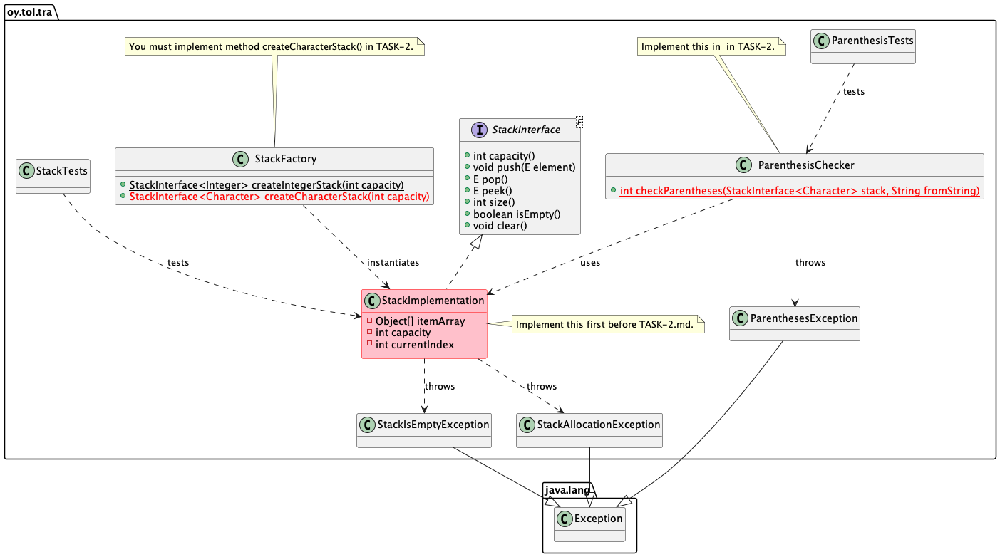

# 04-1-stack Pinotietorakenne

Tietorakenteet ja algoritmit 2022.

## Tehtävän 1 tavoite

* Tehtävän tavoitteena on toteuttaa pinotietorakenne (Stack).
* Toteutuksen täytyy läpäistä kaikki harjoituksen testit.
* Aikakompleksisuusvaatimukset:
  * `capacity()`: O(1).
  * `push()`: O(1) paitsi kun joudutaan reallokoimaan: O(n).
  * `pop()`: O(1).
  * `peek()`: O(1).
  * `size():` O(1).
  * `isEmpty():` O(1).
  * `toString()`: O(n).

Huomaa, että tämä ohje kuvaa harjoituksen ensimmäisen tehtävän. Toinen tiedosto [TASK-2.md](TASK-2.md) kuvaa toisen harjoituksen tehtävän. Ensin seuraa tätä ohjetta, ja kun `StackTests` -testit menevät läpi, siirry tehtävään [TASK-2.md](TASK-2.md).

Pinoa toteuttaessasi, varmista ettet laita luokan jäsenmuuttujiksi sellaisia tietoelementtejä joita ei tarvita koko pino-olion elinajan. Jos tarvitset jotain muuttujaa ja sen arvoa vain yhdessä metodissa, muuttuja kuuluu metodin paikalliseksi muuttujaksi. Turhat jäsenmuuttujat kuluttavat turhaa muistia.

## Edeltävyydet

Työkalut toimivat koneellasi, olet testannut sen harjoituksessa `00-init`.

## Ohjeet

Alla oleva UML -luokkamalli kuvaa harjoituksen rakenteen. Huomaa että tässä 1. vaiheessa työskentelet *vain* luokan `StackImplementation` parissa. Luokkia `ParenthesisChecker.java` ja metodia `StackFactory.createCharacterStack()` ei tarvita ennenkuin alat tekemään harjoituksen tehtävää [TASK-2.md](TASK-2.md).

> Halutessasi voit luoda uuden pääohjelmatiedoston, vaikkapa `src/main/java/oy/tol/tra/Main.java`, jossa voit omassa main() -metodissasi kokeilla toteutustasi. Huomaa kuitenkin että harjoituksen päätavoite on saada annetut yksikkötestit menemään läpi oman pino -toteutuksesi kanssa. **Älä tee** main() -metodia tietorakenneluokkiin tai testihakemistoihin!



**Toteuta** rajapinta `StackInterface` omassa luokassasi. Tiedosto `StackImplementation.java` johon sen teet, on jo olemassa hakemistossa `src/main/java/oy/tol/tra/`!

Huomaa että toteutuksessa käytetään geneerisiä luokkia template -parametrilla `E` joka esitellään rajapintaluokassa `StackInterface`:

```Java
public class StackImplementation<E> implements StackInterface<E> {
```
Pino on siis geneerinen tietorakenneluokka, jonne voidaan laittaa mitä vaan olioita. Geneeriset luokat on opetettu Ohjelmointi 2 -kurssilla, tämän kurssin luennoilla ja löydät niistä lisätietoa kirjallisuudesta ja verkkolähteistä.

Lue ohjeiden lisäksi `StackInterface` -luokan dokumentaatio sen kommenteista **huolellisesti läpi** jotta toteutuksesi noudattaa rajapintaluokassa määriteltyjä vaatimuksia! Tietysti sinun täytyy tuntea pino-tietorakenteen käsite joten **varmista** että olet tutustunut pinoon (Stack) kurssin luentomateriaalin ja kirjallisuuden kautta.

Tässä harjoituksessa toteutamme pinon sisäisen tietorakenteen tavallisilla Javan taulukoilla, joka sisältää pinoon laitettavat oliot:

```Java
private Object [] itemArray;
```

Koska *kaikki* Javan luokat perivät viime kädessä luokan `Object`, voimme luoda taulukon joka sisältää näitä `Object` -luokan olioita (oikeastaan sen aliluokkia siis).

Luokan `StackImplemention` muodostimessa (constructor), seuraa ohjeita joiden perusteella pino varaa muistia taulukkoon näitä pinon elementtejä varten. Esimerkiksi näin:

```Java
   itemArray = new Object[capacity];
```
Muodostin luo tilaa vain rajatulle määrälle olioita. Sinun täytyy huolehtia siitä, että jos tämä tila loppuu kesken kun pinon `push()` -metodia kutsutaan, siellä tarpeen vaatiessa *reallokoidaan lisää tilaa* uusien olioiden lisäämiseksi uudelleen allokoituun isompaan taulukkoon!

Kun olet toteuttanut kaikki metodit stack-luokkaan, voit huomata että tällainen pino-olio luodaan puolestasi `StackFactory.createIntegerStack()` -metodissa. Tämän jälkeen olet valmis testaamaan toteutustasi.

> **Huomautus**: toteutuksesi metodien `pop()`, `peek()`, `size()` ja `isEmpty()` aikakompleksisuuden tulee olla O(1).

**Toteuta** pinoosi myös `Object` luokasta perittävä metodi `String toString()`:

```Java
@Override
public String toString() {
   ...
```
Siten että palautettu merkkijono sisältää pinon sisällön alkaen "pohjalta", *täsmälleen* seuraavassa formaatissa, pilkut ja välilyönnit mukaanlukien:

```text
[110, 119, 121]
```

Esimerkkipinon sisältö on luotu kutsumalla `stack.push(110)`, `stack.push(119)` ja `stack.push(121)`. Tyhjä pino palauttaa merkkijonon "[]". Huomaa että pino voi sisältää *mitä tahansa* Java -luokkia, muutakin kuin Integer -olioita!

## Testaus

**Suorita testit StackTests testiluokassa** joilla varmistat että pino -toteutuksesi läpäisee yksikkötestit. Voit suorittaa testit komentoriviltä (hakemistossa jossa harjoituksen `pom.xml` tiedosto on):

```
mvn -Dtest=StackTests test
```

Jos testit eivät mene läpi, näet virheitä. Muussa tapauksessa testit onnistuivat ja toteutuksesi toimii. Jos virheitä tuli, korjaa toteutustasi ja yritä uudelleen. Jos et tiedä mikä meni vikaan, kysy opettajilta harjoituksissa. Lue myös huolellisesti testien virheilmoitukset. Käytä debuggeria jotta voit askeltaa koodia paikkaan jossa homma lähtee käsistä. Pohdi miksi näin tapahtui. **Lue alta lisää ohjeita** testaamiseen ja debuggaamiseen.

Kurssin demoissa ja demovideoissa näytetään miten testit voi ajaa VS Codesta käsin. Huomaa että tässä vaiheessa et suorita kaikkia testejä vaan ainoastaan testejä `StackTests.java` -testiluokassa.

Harjoitusta tehdessäsi **et saa muuttaa**:

* `StackInterface` rajapintaluokkaa.
* Muuttaa yksikkötestejä.

Ainoa tiedosto jota sinun tarvitsee muokata on pinon toteutusluokan .java -tiedosto.

## Testauksen ja debuggauksen periaatteet

Muista aina **lukea huolella** mitä testit sanovat kun ne epäonnistuvat. Testit aina ilmoittavat mitä testi *odotti* tapahtuvan ja mitä *oikeasti tapahtui*. Lue nämä viestit huolellisesti ja kysy itseltäsi: **miksi näin tapahtui?**. Miksi se mitä *odotettiin* tapahtuvan, **ei tapahtunut?**

Tutki myös epäonnistuneiden *testien koodia* ja katso *miten* se kutsuu omaa koodiasi ja missä järjestyksessä. Aina siihen asti jossa asiat menivät pieleen. Huomaa, että ongelman *varsinainen syy* ei välttämättä ole siinä kohtaa missä testi epäonnistui. Voi olla että virhe tapahtui *aikaisemmin*, jossain toisessa metodissa, joka sössi asiat. Tätä ei vaan huomata ennenkuin pinon kanssa yritetään tehdä jotain muuta. Voi olla esimerkiksi että testi epäonnistuu kutsuttaessa pinon `pop()` -metodia, mutta virhe tehtiin jo aikaisemmin pinon `push()` -metodin kutsun yhteydessä.

Kun luokalla on useita metodeja joita kutsutaan eri järjestyksessä eri paikoista, muuttaen olion tilaa, voi olla että olion tila meni sekaisin paikassa A. Sitten myöhemmin, paikassa B, tämä tilan sekaisin meneminen vasta aiheuttaa ongelmia.

Mitä siis voi tehdä? Tietysti ensimmäinen asia on se, että varmistat että olet ymmärtänyt mitä luokan pitäisi tehdä, mitä kunkin metodin pitäisi tehdä ja miten kokonaisuutena olion pitäisi toimia. Voit myös debugata sitä miten luokkasi toimii, laittamalla pysäytyspisteitä (**breakpoints**) joko omaan koodiisi tai testikooodiin, tai molempiin. Nämä kannattaa laittaa tietysti paikkoihin jotka suoritetaan *ennen* kuin testi epäonnistuu.

Sitten käynnistä testit *debuggaamalla*. Kun koodin suoritus pysähtyy breakpointiin, *huolellisesti* tutki mikä on olion tila sillä hetkellä. Onko se se mitä sen pitäisi olla? Onko esimerkiksi pinon sisäisessä taulukossa se määrä olioita mitä siellä pitäisi olla? Ovatko ne siellä oikeassa järjestyksessä? Ovatko muut olion jäsenmuuttujat arvoltaan sitä mitä niiden pitäisi tällä hetkellä olla?

Jos esimerkiksi näet että testikoodi laittaa kolme oliota pinoon ennen pysäytyspistettä, ovatko ne kolme oliota pinon taulukossa ja oikeassa järjestyksessä? Muut pinon jäsenmuuttujat ovat yhtä mieltä siitä mikä on pinon tilanne?

Sitten kun tilannekuva on selvä, *hitaasti* askella yksi rivi kerrallaan koodia eteenpäin. Joka askeleen jälkeen mieti huolella: onko se mitä tapahtui sitä mitä *piti* tapahtua ja mitä *mielestäni* koodasin tapahtuvaksi? *Älä oleta* että koodisi toimii oikein vaan tutki *toimiiko se oikeasti oikein*!

Kerää tietoa siitä miten koodi toimii ja koko ajan tarkenna tietoasi siitä missä kohtaa asiat menevät pieleen ja missä kohtaa se pieleen meneminen oikeastaan alkaakaan. Toista tätä prosessia niin kauan että saat selville miksi asiat menevät pieleen.

Debuggauksen aikana pidä koko ajan huomiosi **debuggerin muuttujanäkymässä** jossa näet kaikkien muuttujien arvot. Vie hiiri koodissa olevien muuttujien päälle kohdassa jossa suoritus on menossa, ja tutki sillä tavalla mitä arvoja muuttujissa on.

Kun löydät ongelman juurisyyn, joka aiheutti testin epäonnistumisen, korjaa virheesi. Ja testaa heti uudelleen auttoiko korjaus. Vai kävikö niin että korjaus synnytti uuden virheen kenties ihan eri paikkaan... :/

Pyri yksinkertaiseen koodiin. Monimutkainen koodi sisältää helposti enemmän virheitä kuin yksinkertainen. Älä ala värkkäilemään kaikenlaisia kokeiluja joka vaan tekee koodista isomman härdellin. Ennemmin pysähdy miettimään mitä tässä pitikään tehdä ja pyri tekemään tämä mahdollisimman yksinkertaisesti.

## Toimitus

Jatka tästä harjoituksen osaan kaksi [TASK-2.md](TASK-2.md). Kun sekin on valmis, harjoitus on tehty. Muista käyttää git:iä ja myös työntää versioita etärepositoryysi säännöllisesti.

## Kysymyksiä, ongelmia?

Osallistu kurssin luennoille, harjoituksiin ja hyödynnä kurssilla tarjottua etätukea.

## Tietoja

* Kurssimateriaalia Tietorakenteet ja algoritmit -kurssille | Data structures and algorithms 2021-2022.
* Tietojenkäsittelytieteet, Tieto- ja sähkötekniikan tiedekunta, Oulun yliopisto.
* (c) Antti Juustila 2021-2022, INTERACT Research Group.