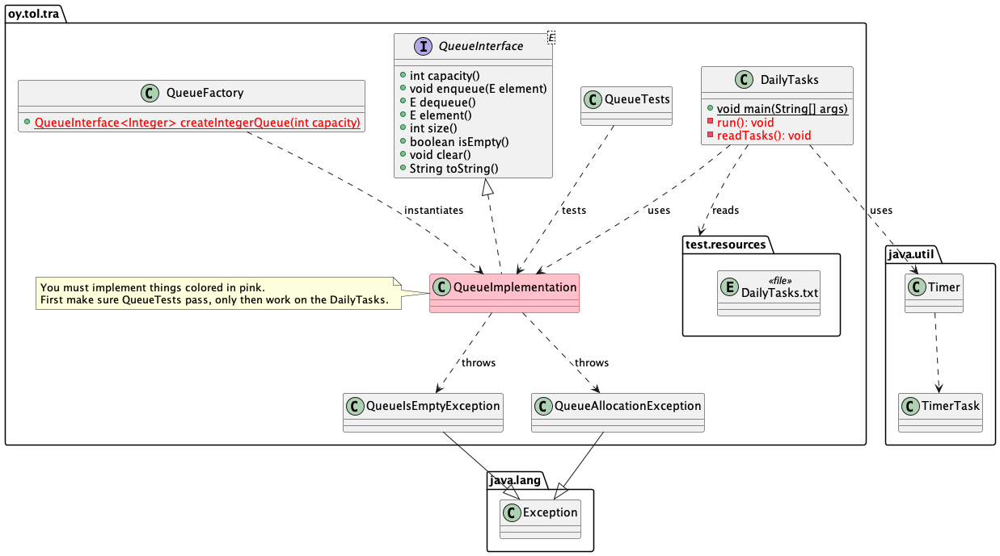

# 04-2-queue Jono

Tietorakenteet ja algoritmit | Data structures and algorithms 2022.

## Tavoite

* Harjoituksen tavoitteena on oppia toteuttamaan jono -tietorakenne (queue).
* Toteutuksen täytyy läpäistä kaikki testit.
* Kun testit menevät läpi, **toteuta** myös puuttuva osuus `DailyTasks.java` luokasta jossa jonototeutustasi käytetään hyödyksi.
* Kun olet valmis, toimita harjoitus ohjeita noudattaen tarkistettavaksi.
* Aikakompleksisuusvaatimukset:
  * `capacity()`: O(1).
  * `enqueue()`: O(1) paitsi kun joudutaan reallokoimaan: O(n).
  * `dequeue()`: O(1).
  * `size():` O(1).
  * `isEmpty():` O(1).
  * `element():`O(1).
  * `toString()`: O(n).

## Edeltävyydet

Työkalut on asennettu ja toimivat. Olet tehnyt pino -harjoituksen (`04-1-stack`) joka antaa pohjaa tälle harjoitukselle. 

## Ohjeet

UML -luokkamalli alla antaa yleiskuvan harjoituksesta.



**Toteuta** rajapintaluokka `QueueInterface` omassa tiedostossaan. **Luo** uusi tiedosto `QueueImplementation.java` ja pidä huolta että se sijoittuu `oy.tol.tra` Java packageen, kuten muutkin harjoituksen lähdekooditiedostot. 

> Huomaa: Toteutuksessasi metodien `dequeue()`, `element()`, `size()` ja `isEmpty()` aikakompleksisuuden tulee olla O(1).

Muista **lisätä** uusi .java -tiedosto **git** alle, versionhallintaan!:

```console
git add src/main/java/oy/tol/tra/QueueImplementation.java 
```
Muuten tiedosto ei päädy etärepositoryysi ja opettajat eivät saa sitä kun palautuksesi arvioidaan!

Toteuta jono geneerisenä siten että käytät template parametria `E` joka on esitelty rajapinnassa `QueueInterface`:

```Java
public class QueueImplementation<E> implements QueueInterface<E> {
```

**Lue huolellisesti** dokumentaatio `QueueInterface` rajapinnassa, siten että toteutuksesi seuraa dokumentointia. Luonnollisesti jono-tietorakenteen periaatteet pitäisi olla myös tiedossasi, joten **varmista** että olet tutustunut kurssimateriaaliin ja muihin lähteisiin joissa jono -tietorakenne esitellään.

Jos liikkeelle lähtö on vaikeaa, kertaa vielä edellinen pino -harjoitus ja sen toteutus. Tässä harjoituksessa rakenne on samankaltainen, vaikka jono logiikka onkin eri kuin pinon. Käytä tavallista Javan Object -taulukkoa pinon sisäisenä tietorakenteena. Toteuta jonolle muodostin (constructor) seuraten pino-harjoituksen esimerkkiä.

Huolehdi siitä että toteutat jonon sisäisen **taulukon reallokoinnin** kun taulukon tila loppuu, elementtejä lisätessä. Reallokoinnin jälkeen voit lisätä uuteen isompaan taulukkoon lisää olioita. Huomaa kuitenkin että jonolla (kuten myös pinolla) on vain yksi taulukko jäsenmuuttujana. Muita jäsenmuuttujia ovat vain ne joita jono tarvitsee useissa metodeissaan. Muut muuttujat pitää laittaa paikallisiksi muuuttujiksi niihin metodeihin joissa niitä tarvitaan.

**Varmista** että kaikki ylikuormitetut metodit on merkitty `@Override`:lla:

```Java
@Override
   public int capacity() {
```
Kuten mainittu, käytä sisäisenä tietorakenteena tavallista taulukkoa Object -olioita:

```Java
private Object[] itemArray;
```

Ja `QueueImplementation`:in muodostimessa, allokoi taulukko ja alusta muutkin jäsenmuuttujat järkevillä arvoilla:

```Java
   itemArray = new Object[capacity];
   ...
```
Jonon alkutilan pitäisi näyttää tältä:

```console
arvot: 
index:  0 1 2 3 4 5 6 7 8 9
        ^
        head tail -- head ja tail viittaavat molemmat indeksiin 0
size: 0
capacity: 10
```

**Ylikuormita** myös Javan `Object` -luokasta peritty `toString()` -metodi.

Sen tulee palauttaa jonon sisältö merkkijonona muodossa "[1, 2, 3, 4, 5]", jossa 1 on seuraava jonosta otettava elementti (head), ja 5 on viimeisenä jonoon laitettu elementti. Jos jono on tyhjä, metodin tulee palauttaa merkkijono "[]". 

Huomaa toteuttaessasi tätä, että jonon sisäisen taulukon tilanne voi olla vaikkapa tämä:

```text
Esimerkki kokonaislukujonosta (Integer), taulukon koko 10:
index:  0   1  2 3 4 5 6 7 8  9
items: [11,12,13,_,_,_,_,8,9,10]
                 ^       ^
                 tail    head
```

Eli jonoon on lisätty numeroita 1:stä eteenpäin, sitten poistettu numeroita (1...7) jonka jälkeen on taas lisätty numerot 8...13.
    
Tämän esimerkkijonon toString() pitää palauttaa merkkijono "[8, 9, 10, 11, 12, 13]".

Muista toteuttaa taulukon **reallokointi** -- kasvattaa sen kokoa -- kun taulukkoon lisätään elementtiä eikä se enää mahdu sinne!

Tämä tapahtuu samaan tyyliin kuin pino -harjoituksessa Nyt on vaan huomattava se, että *taulukon käsittely on erilaista jonossa kuin pinossa*. Pinossa oliot ovat taulukossa aina indeksistä 0 eteenpäin. Mutta jonossa, kun elementtejä lisätään ja otetaan jonosta pois, elementit voivat olla jonossa vaikkapa näin:

```console
values: 6 1 0 9 9 1 8 2 . .  .  .  .  .  9  2  6 
index:  0 1 2 3 4 5 6 7 8 9 10 11 12 13 14 15 16
                        ^                ^      
                        tail             head
```
Eli kun tuon taulukon kokoa kasvatetaan, ei voi vain triviaalisti siirtää alusta indeksistä 0 eteenpäin elementtejä uuteen isompaan taulukkoon. Vähän sama asia kuin tulostuksessa.

Esimerkiksi, jos jonon kapasiteetti oli aluksi 10, ja se on ehditty täyttää seuraavalla tavalla:

```console
values: 6 1 0 9 9 1 8 2 9 2
index:  0 1 2 3 4 5 6 7 8 9
                    ^      
                    tail head (head ja tail molemmat indeksissä 6; taulukko on täynnä!)
```

Kun reallokointi on tehty ja uudessa taulukossa on nyt tilaa enemmän (20 elementille) taulukon pitäisi näyttää tältä:

```console
values: 8 2 9 2 6 1 0 9 9 1 
index:  0 1 2 3 4 5 6 7 8 9 10 11 12 13 14 15 16 17 18 19
        ^                    ^      
        head                 tail 
```
Ja uusi elementti voidaan lisätä nyt indeksiin `tail`.

Kun saat toteutuksen eteenpäin, muista **instantioida** olio metodissa `QueueFactory.createIntegerQueue()` joka luo jonon kokonaislukuja. Kun jonosi toimii, voit testata sitä.

## Testaus

**Suorita QueueTests testit** varmistaaksesi että toteutuksesi läpäisee yksikkötestit. Testit voit käynnistää komentoriviltä (hakemistossa jossa harjoituksen `pom.xml` tiedosto on) komennolla:

```
mvn test
```

Jos testit eivät mene läpi, näet virheitä. Muussa tapauksessa testit onnistuvat ja toteutus toimii. Korjaa mahdolliset virheet ja testaa uudelleen.

Kun toteutat jonoa, **älä**:

* Muuta `QueueInterface` luokkaa millään tavoin.
* Muuta yksikkötestejä millään tavoin.

Ainoa tiedosto jota sinun tarvitsee muuttaa on jono -tietorakenteen toteutustiedosto.

## Toteuta DailyTasks -sovellus

Tiedosto `DailyTasks.java` sisältää koodia joka käyttää jono -toteutustasi näyttämään ajoitetusti päivän tehtävälistaa. Todellisessa sovelluksessa tietoja näytettäisiin aina kun kyseinen tehtävä on ajankohtainen. Mutta tämä onkin vain demonstraatio siitä miten jonoja käytetään.

**Toteuta** puuttuva koodi seuraten tarkkaan koodissa olevia kommentteja. Huomaa että jokaisen kommenttirivin alle kuuluu tulla yksi rivi koodia! Jos tarvitset ohjeita tai vinkkejä toteutukseen, tule kurssin harjoituksiin!

Kun toteutus on valmis, suorita se joko VS Codesta käsin (näet `Run|Debug` komennot ihan `main()` metodin yläpuolella), tai komentoriviltä:

```command
mvn package
java -jar target/04-queue-1.0-SNAPSHOT-jar-with-dependencies.jar
```

Katso miten toteutuksesi toimii. Sinun pitäisi nähdä yksi tehtävä (rivi) kerrallaan tulostettuna lyhyin väliajoin.

## Toimitus

Toimita toteutuksesi arvioitavaksi etärepositoryyn kurssin ohjeiden mukaisesti.

## Kysymyksiä / ongelmia?

Osallistu kurssin luennoille, harjoituksiin ja hyödynnä kurssin keskustelufoorumia.

Jos työkalujen kanssa on ongelmia, varmista ohjeiden avulla että kaikki on kunnossa.

## Tietoja

* Materiaalia kurssille Tietorakenteet ja algoritmit | Data structures and algorithms 2022.
* Tietojenkäsittelytieteet, Oulun yliopisto.
* Antti Juustila, INTERACT Research Group.