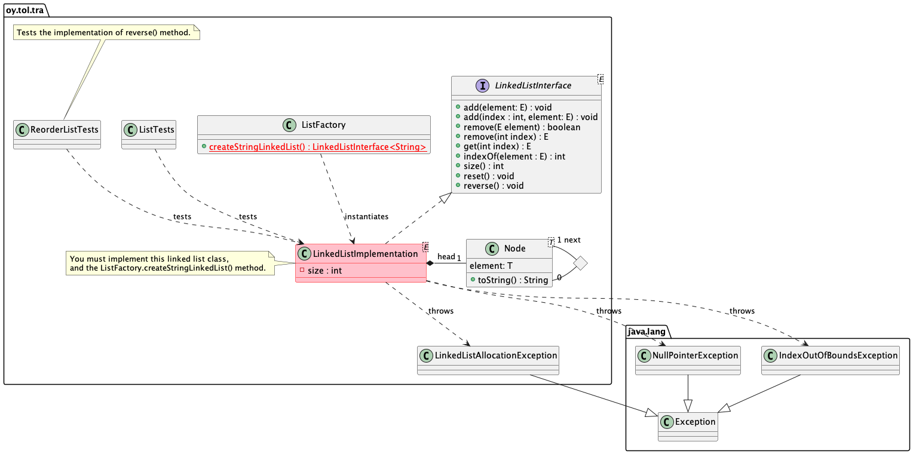

# 04-3-linkedlist Linkitetty lista

Tietorakenteet ja algoritmit.

## Tehtävän 1 tavoite

> **HUOM** 99.99%:lle meistä, tehtävän tekeminen *edellyttää* kynän ja paperin käyttöä jotta osaisimme suunnitella miten linkitetyn listan eri algoritmit toimivat. Nämä kannattaa siis toteuttaa tämä siten että *jatkuvasti* olet pähkäillyt kynän ja paperin kanssa miten algoritmi toimii ja vasta sitten etenet ohjelmoimaan. Ilman paperin ja kynän käyttöä on melko todennäköistä että toteutuksesstasi tulee aivan liian monimutkainen ja buginen. Tätä voi olla vaikea uskoa, mutta näin se vaan on.

Jos et ole jo opetellut **käyttämään debuggeria** ongelmien diagnosointiin ja ratkomiseen, nyt on sille hyvä aika.

* Harjoituksen tavoitteena on toteuttaa linkitetty lista -tietorakenne.
* Toteutuksen täytyy läpäistä kaikki testit `ListTests.java` -testeissä.
* Kun toteutus läpäisee em. testit, voit jatkaa harjoituksen tehtävään 2.

Huomaa että tässä ohjeistetaan harjoituksen ensimmäinen tehtävä, ja **toisessa tiedostossa** `TASK-2.md` kuvataan harjoituksen toinen tehtävä. Tee ensin tämä harjoitus ja vasta kun olet valmis, etene tehtävään [TASK-2.md](TASK-2.md).

Lista joka tässä toteutetaan on yksinkertainen **yhteen suuntaan** linkitetty lista. Listalla on elementtejä seuraavaan listan elementtiin, *ei edelliseen*. Lisäksi tässä toteutetaan vain listan `head` elementti, tässä ei ole tarpeen ylläpitää `tail` -elementtiä.

Huomaa että listan algoritmien `size()` ja `clear()` täytyy toteuttaa aikakompleksisuus O(1). Muut metodit ovat toteutuksen suunnittelusta johtuen O(n).

## Edeltävät tehtävät

Työkalut toimivat, olet tehnyt ensin pino ja jono -harjoitukset.

## Ohjeet

Alla oleva UML -luokkamalli kuvaa harjoituksen rakenteen.



**Toteuta** rajapinta `LinkedListInterface` omaan luokkaansa tiedostoon `LinkedListImplementation.java` joka on jo olemassa. Toteuta kaikki metodit siten että testit `ListTests.java` -tiedostossa menevät läpi. Älä yritä vielä suorittaa testejä tiedostossa `ReorderListTests.java`, ne kuuluvat vasta harjoituksen toiseen tehtävään.

**Lue** ohjeet `LinkedListInterface`:n kommenteissa **huolellisesti** jotta toteutuksesi noudattaa rajapinnan ohjeita. Selvää on myös se , että sinun täytyy tuntea linkitettyjen listojen perusteet, joten **varmista** että olet tutustunut kurssin luentomateriaaleihin linkitetyistä listoista, ja muuhun mahdolliseen materiaaliin.

Huomaa myös että annetussa pohjassa on jo toteutettu valmiiksi linkitetyn listan solmu luokassa `Node` jota hyödynnät. `Node` on apuluokka joka määrittelee listan elementit. `Node`:ssa on `next` elementti, joka on myös `Node`. Tämä luokka `Node` sisältää jäsenmuuttujan `element`, joka on se varsinainen tieto jota linkitetty lista pitää sisällään. Harjoituksessa ei ole tarpeen muuttaa tai listätä mitenkään `Node` -luokkaa, käytät vaan sitä hyödyksesi.

Kun olet saanut toteutuksesi tehtyä, **instantioi** olio tehdasluokan metodissa `ListFactory.createStringLinkedList()`. Tämän jälkeen olet valmis testaamaan toteutustasi.

Huomio syntaksista. Muistat varmaan (Ohjelmointi 2 -kurssilta) miten geneerisiä luokkia käytetään. Tämä on syntaktisesti oikea tapa luoda geneerisestä luokasta olio:

```Java
MyGenericClass<String> anObject = new MyGenericClass<>();
```

Huomaa miten timanttisymbolia `<>` käytetään, ja mihin template parametri (tässä String) laitetaan. Älä unohda käyttää timanttisymbolia, muuten koodiin ilmestyy varoituksia. Koodisi pitäisi noudattaa periaatetta "zero errors, zero warnings".

Linkitetyssä listassasi, **toteuta** myös metodi `String toString()` joka periytyy `Object` -luokasta:

```Java
@Override
public String toString() {
   ...
```
Palautettu merkkijono sisältää listan sisällön, sen alusta (head) eteenpäin. Noudata *täsmälleen* annettua formaattia, pilkut ja välilyönnit mukaanlukien:

```text
[110, 119, 121]
```

Tämä esimerkkilista on luotu kutsumalla `list.add(110)`, `list.add(119)` ja `list.add(121)`. Tyhjän listan tulee palauttaa merkkijono "[]". Huomaa että linkitetyn listan tulee voida sisältää mitä tahansa Java -olioita, kokonaislukujen (Integer) lisäksi!

## Testaaminen

**Suorita ListTests -testit** ja varmista että toteutuksesi läpäisee kaikki yksikkötestit. Voit suorittaa testit komentoriviltä (hakemistossa jossa harjoituksen `pom.xml` sijaitsee), komennolla:

```
mvn -Dtest=ListTests test
```

Jos testit eivät mene läpi, näet virheilmoituksia. Muuten testit onnistuvat. Jos ongelmia löytyy, korjaa toteutustasi niin että testit menevät läpi.

Kurssin demoista näet miten testejä voidaan suoritttaa Visual Studio Codesta käsin. Huomaa vielä että nyt tässä vaiheessa suoritetaan vain testit tiedostossa `ListTests.java`.

Kun teet tätä harjoitusta, **älä**:

* Muuta `LinkedListInterface` -rajapintaa millään tavalla.
* Muuta yksikkötestejä millään tavalla.

Ainoa asia johon tarvitsee tehdä muutoksia, on toteutuksesi linkitetystä listasta.

## Toimitus

Toimita harjoitus arvioitavaksi kun olet tehnyt harjoituksen toisen tehtävän joka kuvataan tiedostossa [TASK-2.md](TASK-2.md).

## Kysymyksiä tai ongelmia?

Osallistu luennoille, harjoituksiin ja käytä kurssin keskustelualuetta Moodlessa.

## Tietoja

* Tietorakenteet ja algoritmit 2022.
* Tietojenkäsittelytieteet, Oulun yliopisto.
* Antti Juustila, INTERACT Research Group.
