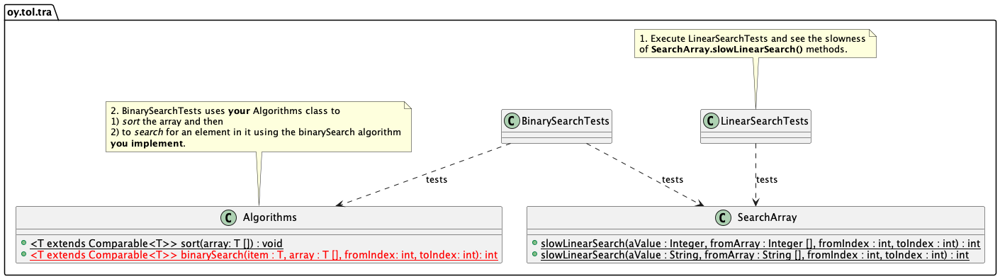

# Puolitushaku

Tietorakenteet ja algoritmit 2022.

## Tavoite

* Harjoituksen tavoitteena on toteuttaa **puolitushakualgoritmi** (binary search).

> Huomaathan että puolitushaku**algoritmi** *ei ole* sama asia kuin binääri**puu-tietorakenne** (binary search *tree*)! Jos olet tästä epävarma, kertaa kurssin luennot aiheista!

Koodi joka on valmiina harjoituksessa, sisältää lineaarisen hakualgoritmin. Sitä tarvitaan jotta voidaan vertailla lineaarisen haun suoritusnopeutta puolitushakualgoritmiin.

Yksikkötestit tässä harjoituksessa suorittavat molempia hakualgoritmeja ja testaavat onko toteutuksesi puolitushausta nopeampi kuin lineaarinen hakualgoritmi.

UML -luokkamalli alla esittelee harjoituksen rakenteen.



## Edeltävyydet

Työkalut toimivat, olet tehnyt aiempia harjoituksia, erityisesti toteuttanut aikaisemmin `Algorithms` -luokkaan yksinkertaisen vaihtolajittelualgoritmin (harjoitus `01-arrays`).


## Ohjeet vaiheeseen 1

Aluksi, **kopioi** luokan `Algorithms` toteutus edellisestä harjoituksesta jossa sitä viimeksi muokkasit (`03-draw`), *tämän harjoituksen lähdekoodihakemistoon*. 

**Toiseksi**, lisää tämä tyhjä metodi binäärihaulle `Algorithms.java` -tiedostoosi:

```Java
public static <T extends Comparable<T>> int binarySearch(T aValue, T [] fromArray, int fromIndex, int toIndex) {
	// TODO Implement this in step 2.
	return 0;
}
```

Nyt harjoituksen testit, jotka olettavat että tuo binäärihakualgoritmi löytyy koodista, kääntyvät.

**Kolmanneksi** suorita *vain*  lineaarisen haun testit testiluokassa `LinearSearchTests` jotta näet miten se suoriutuu. Lineaarinen haku on toteutettu valmiiksi metodiin `SearchArray.slowLinearSearch`. Voit suorittaa testin joko VS Codesta käsin tai komentoriviltä:

```console
mvn -Dtest=LinearSearchTests test
```

Näet tästä `SearchArray` -luokasta että lineaarinen haku on toteutettu kahdesti, kerran `Integer` -taulukoille ja toisen kerran `String` -taulukoille. Koodi näyttää täsmälleen samalta molemmissa toteutuksissa.

Lineaarinen haku on hidas. Lisäksi siitä on nyt kaksi samanlaista toteutusta. Ei kannata toteuttaa samaa algoritmia kahdesti jos sen voi välttää. Se ei tue koodin uudelleenkäyttöä.

Siksi toteutatkin seuraavaksi geneeerisen puolitushakualgoritmin joka on a) nopeampi ja b) yleiskäyttöinen ja uudelleenkäytettävä.

## Ohjeet vaiheeseen 2

**Seuraavaksi, toteuta** puolitushakualgoritmi jonka rungon lisäsit jo `Algorithms` -luokkaan edellisessä vaiheessa.

Puolitushaku **edellyttää**  että taulukko josta etsitään, on **lajiteltu**. Jos teet puolitushakua lajittelemattomaan taulukkoon, haku epäonnistuu. Onneksi olet toteuttanut geneerisen lajittelualgoritmin `Algorithms` luokkaan harjoituksessa `01-arrays`!

Näet että yksikkötestit luokassa `BinarySearchTests` kutsuvat sinun toteutustasi `Algorithms.sort` ennen puolitushakualgoritmin kutsua:

```Java
   // You must have implemented this as instructed in Exercise 01-arrays!
   Algorithms.sort(array);
```

Myöhemmin testikoodi luokassa `BinarySearchTests` kutsuu myös sinun toteutustasi puolitushausta:

```Java
   int binaryIndex = Algorithms.binarySearch(toFind, array, 0, array.length - 1);
```

Eli -- testit käyttävät ensin sinun lajittelualgoritmiasi ja sitten toteuttamaasi puolitushakua jotta nähtäisiin onko puolitushaku nopeampi kuin lineaarinen haku.

Kun toteutat puolitushakua, **älä muuta** testejä millään tavoin.

Seuraavaksi sitten testaamaan.

## Testaaminen

**Suorita testit BinarySearchTests** jotta varmistat että toteutuksesi läpäisee yksikkötestit. Voit suorittaa testit komentoriviltä (hakemistossa jossa harjoituksen `pom.xml` tiedosto):

```console
mvn -Dtest=BinarySearchTests test
```

Jos testit eivät mene läpi, näet virheilmoituksia. Siinä tapauksessa korjaa koodiasi. 

Ihan perusasioihin liittyvät virheet testataan testifunktiossa `BinarySearchTests.simpleSearchTest`, jonka voi suorittaa vain tuota testiä ajamalla VS Codesta tai komentoriviltä:

```console
mvn -Dtest=BinarySearchTests#simpleSearchTest test
```

Tuossa testissä on yksinkertainen kymmenen elementin taulukko josta etsitään kohteita jotka ovat taulukon alussa, keskellä ja lopussa. Lisäksi etsitään elementtiä jota ei ole taulukossa. Jos toteutuksessa on ongelmia, kannattaa ajaa ensin tätä testiä ja sitten vasta muita.

Kun suoritat testejä, näet myös **tulostuksia** testeistä, kun testit etsivät elementtejä taulukoista, joko `Integer` tai `String` -olioita. Lopuksi testit tulostavat myös nopeusmittausten tulokset:

```console
Average linear search duration:     361129 ns
Average binary search duration:       3558 ns
```

> *Joskus* taulukoihin generoidut elementit sijoittuvat niin että lineaarisen haun keskimääräinen aika on *pienempi* kuin binäärisen haun. Testit ilmoittavat tämän virheenä. Jos tämä tapahtuu vain joskus, koodisi toimii, mutta satunnaisuus saa aikaan sen että lineaarinen haku on nopeampi. Näinkin voi joskus käydä. Testin epäonnistuminen silloin tällöin sen takia että lineaarinen haku oli nopeampi, ei siis ole ongelma.

Sinun pitäisi nähdä että puolitushaku on yleensä *paljon nopeampi* kuin lineaarinen haku. 

**Asiassa on vain yksi mutta.**

Kun lasketaan puolitushaun ja *lajittelun suoritusaika yhteen*, tämä on paljon hitaampaa kuin lineaarinen haku!:

```console
Sorting the array took 11329947083 ns
...
Average linear search duration:     361129 ns
Average binary search duration:       3558 ns
```

No mikä on tämän puolitushaun idea sitten?! Siinä on **kolme** ideaa:

1. Useinmiten todellisissa tilanteissa, lajittelu tehdään vain *kerran* tai harvoin (kun tietojoukko muuttuu) -- tämän vähän hitaamman lajittelu+haku jälkeen, lajittelua ei enää tarvitse tehdä, ja puolitushaun nopeusetu tulee selkeästi esille kun kaikki haut tämän jälkeen ovat nopeita.
2. Harjoituksessa `01-arrays` toteuttamasi lajittelualgoritmi on todennäköisesti hidas lisäyslajittelu tai kuplalajittelu tai jotain hitaampaa. Nämä ovat erittäin hitaita algoritmeja isoilla tietomäärillä. Nopeampi hakualgoritmi esimerkiksi näissä testeissä voi olla vaikkapa 1000 kertaa nopeampi kuin toteuttamasi lisäyslajittelu.
3. Vaikka lajittelualgoritmisi olisi erittäin nopea, jos taulukko täytyy lajitella *aina* joka kerta ennen puolitushakua, voi olla että kannattaisi pitäytyä lineaarisessa haussa, koska lajittelun ja puolitushaun *kokonaisaika* voi olla hitaampi kuin lineaarisen haun lajittelemattomalle taulukolle. Joten on syytä aina *tapauskohtaisesti* miettiä kannattaako lajittelu ja puolitushaku vai ei.

Tässä harjoituksessa aiemmin toteuttamasi lajittelualgoritmi ei ole tarpeeksi nopea joka "korostaa" tässä esimerkissä kokonaisaikatehokkuuden "huonoutta" kun lajittelu otetaan huomioon. Siksi **seuraavissa harjoituksissa opit toteuttamaan nopeampia lajittelualgoritmeja** jolloin ero pienenee merkittävästi.

Voit vapaasti myöhemmin palata tähän harjoitukseen ja kokeilla miten nopeampi lajittelualgoritmisi parantaa puolitushaun kokonaistehokkuutta suhteessa tähän hitaaseen lisäyslajitteluun.

Voit myös halutessasi tehdä kokeiluja varten omia uusia .java -tiedostoja (hakemistoon `src/main/java/oy/tol/tra`, *ei* testikoodihakemistoon), sinne main -metodin ja kokeilla erilaisilla taulukoilla miten geneerinen puolitushaku toimii.

## Arviointi

Kun olet valmis, toimita harjoituksesi arvioitavaksi kurssilla esitetyllä tavalla etärepositoryysi.

**Muista** lisätä `Algorithms.java` -tiedosto git:iin komennolla `git add` ja sitten tee commit ja push.

## Kysymyksiä tai ongelmia?

Osallistu kurssin luennoille, harjoituksiin ja keskustelufoorumeille.

## Tietoja

* Materiaalia kurssille Tietorakenteet ja algoritmit 2021-2022.
* Tietojenkäsittelytieteet, Oulun yliopisto.
* Antti Juustila, INTERACT Research Group.
