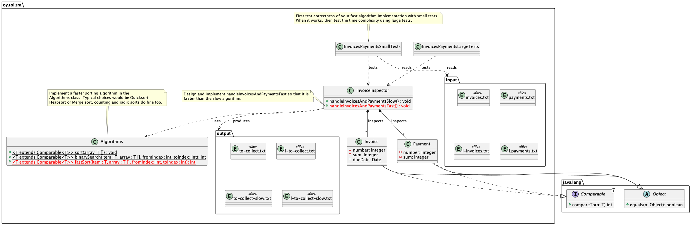

# 05-invoices Suurten taulukkojen yhdistely tehokkaasti

Tietorakenteet ja algoritmit 2022.

> Huomaa: tässä harjoituksessa koodi suorittaessaan algoritmeja *luo* isoja tekstitiedostoja. **Älä lisää näitä git:iin** koska niitä ei tarvitse versioida eikä etenkään ladata etärepositoryyn.

## Tavoite

Harjoituksen tavoitteena on oppia miten suunnitella ja toteuttaa tehokas algoritmi isojen taulukoiden käsittelyyn. Tilanteessa jossa kahden eri taulukon sisältämää tietoa pitää yhdistää ja tehdä siitä uutta dataa.

Harjoitus jakautuu kolmeen vaiheeseen:

1. Tutki valmiina annettua algoritmia joka luo uusia laskuja sellaisista vanhoista laskuista joita ei ole kokonaan maksettu. Tutki algoritmin oikeellisuutta ja aikakompleksisuutta.
2. Suunnittele ja toteuta oikeellinen ja aikakompleksisuudeltaan parempi algoritmi joka tekee saman kuin vaiheen 1 algoritmi.
3. Testaa toteutuksesi oikeellisuutta ja suoritusnopeutta, tarvittaessa sitä parantaen.

**Huomaa** että tässä(kään) tehtävässä **ei saa** käyttää Javan tietosäiliöluokkia (mitään joka toteuttaa suoraan tai epäsuorasti `Collection` tai `Map` rajapinnan, kuten `ArrayList`, `Vector`, ja niin edelleen), eikä algoritmeja esimerkiksi luokista `Arrays` tai `Collections` -- toteutat algoritmit itse. Uusia tietorakenteita tässä ei tarvitse eikä pidäkään toteuttaa. Valmiina annetussa koodissa joitakin näistä käytetään annetun koodin pitämiseksi mahdollisimman yksinkertaisena ja tiiviinä.

## Edeltävyydet

Kuten ennenkin, työkalujen tulee toimia oikein, tiedät miten yksikkötestejä suoritetaan ja osaat testata ja debugata ohjelmaa virheiden korjaamiseksi.

Olet jo toteuttanut geneerisiä algoritmeja omaan `Algorithms` -luokkaasi: hitaan vaihtolajittelujalgoritmin ja puolitushakualgoritmin (binary search algorithm).

**Ennen kuin jatkat**, kopioi `Algorithms.java` edellisestä `05-binsearch` harjoituksesta jossa toteutit luokkaan puolitushaun. **Sijoita** kopioitu tiedosto tämän harjoituksen **lähdekoodihakemistoon** jossa muutkin .java -tiedostot ovat.

## Vaihe 1 - Analysoidaan valmista algoritmia

UML-luokkamalli kuvaa harjoituksen rakenteen.



Projektissa on valmiina seuraavat luokat:

* `Invoice` -- lasku, jossa laskun numero, laskutettava summa sekä eräpäivä asiakkaalle lähetetyistä laskuista.
* `Payment` -- maksu jonka asiakas on maksanut laskusta: sen laskun numero johon maksu kohdistuu, ja asiakkaan maksama summa.
* `InvoiceInspector` -- luokka joka käy läpi laskut ja maksut ja luo tarvittaessa uusia laskuja (samalla laskunumerolla) niistä laskuista joita ei ole vielä kokonaan maksettu.

Huomaa, että sekä `Invoice` että `Payment` -luokat toteuttavat Javan `Comparable` rajapinnan. Tutustu [Comparable rajapintaluokkaan](https://docs.oracle.com/en/java/javase/17/docs/api/java.base/java/lang/Comparable.html). Kuten kaikki Javan luokat, `Invoice` ja `Payment` ovat myös [Object](https://docs.oracle.com/en/java/javase/17/docs/api/java.base/java/lang/Object.html) -luokan aliluokkia. Kertaa mitä metodeja tällä luokalla on ja mitä omat luokat voivat ylikuormittaa (override).

Laskujen käsittelyn säännöt ovat:

* käsiteltävä input -maksutiedosto sisältää yhtä laskua kohden *nolla tai yksi maksua*, *ei* montaa maksua per lasku.
* käsiteltävä maksutiedosto voi sisältää maksuja laskuille jota vastaavaa laskua *ei välttämättä* löydy laskutiedostosta.
* käsittelyn jälkeen uusien laskujen *täytyy* olla laskunumeron mukaan *nousevassa* järjestyksessä.

Laskujen ja maksujen lukeminen tiedostosta on jo toteutettu valmiiksi metodissa `InvoiceInspector.readInvoicesAndPayments()`. Uusien laskujen tallentaminen tulostiedostoon on jo toteutettu valmiiksi metodissa `InvoiceInspector.saveNewInvoices()`. Näitä ei siis tarvitse eikä pidä toteuttaa itse tai muuttaa.

**Tutki hidasta koodia** metodissa `InvoiceInspector.handleInvoicesAndPaymentsSlow()` ja ymmärrä mitä metodi tekee:

1. käydään läpi jokainen lasku...
1.  jokaiselle laskulle, käydään läpi kaikki maksut, ja...
1.  jos laskuun liittyvä maksu löytyi, lasketaan onko vielä jotain maksettavaa, ja...
1.    jos maksu ei kata laskua, luodaan uusi lasku jäljellä olevalle summalle,
1.  ja jos maksua ei löytynyt, koko vanha lasku sellaisenaan lisätään uudelleen laskutettavaksi,
1. seuraavaksi uudet laskut lajitellaan laskun numeron mukaiseen nousevaan järjestykseen **käyttäen toteuttamaasi hidasta `Algorithms.sort` metodia**!...
1. ja lopuksi uudet laskut tallennetaan tiedostoon "to-collect....txt".

Harjoituksessa on kaksi yksikkötestausluokkaa:

* `InvoicesPaymentsSmallTests` -- testit testaavat `InvoiceInspector`:n toimintaa pienillä tietomäärillä. Tämän testin avulla voidaan nopeasti varmistaa toteutettujen algoritmien *oikeellisuus*. Tämä testi käyttää aineistona pieniä input -tiedostoja `invoices.txt` ja `payments.txt`. *Älä muuta* näiden tiedostojen sisältöä mitenkään!
* `InvoicesPaymentsLargeTests` -- testit testaavat `InvoiceInspector`:n toimitaa suurilla tietomäärillä. Näiden testien avulla voidaan varmistaa paitsi toteutuksen oikeellisuus, myös se että toteutus on nopea suurilla tietomäärillä.

Jotta voisimme tarkistaa että algoritmi joka luo uusia laskuja toimii oikein, odotetusta oikeasta tuloksesta on laskettu *tarkistussumma* (checksum). Testit laskevat tarkistussumman myös koodisi avulla luodusta tulostiedostosta. Tätä tarkistussummaa verrataan odotettuun tarkistussummaan. Jos tarkistussummat ovat erit, tuotettu laskutiedosto ei ole oikeellinen ja testi epäonnistuu.

**Suorita** testi `InvoicesPaymentsSmallTests.newInvoicesFromPaymentsSlowTest` jotta voit varmistua siitä että valmiina annettu koodi on *oikellista* ja tuottaa oikean sisältöisen tulostiedoston. Suorita testi joko VS Codesta näpäyttämällä testimetodia `InvoicesPaymentsSmallTests.newInvoicesFromPaymentsSlowTest` tai suorita se komentoriviltä:

```console
 mvn test -Dtest=InvoicesPaymentsSmallTests#newInvoicesFromPaymentsSlowTest test
 ```

Testin pitäisi mennä läpi ilman ongelmia. Jos **katsot** output -tiedostoa `to-collect-slow.txt` jonka koodi tuottaa, ja vertaat sitä lähtötiedostoihin `invoices.txt` ja `payments.txt` voit varmistaa että algoritmi toimii oikein. 

Esimerkiksi, pieni laskutiedosto `invoices.txt` sisältää laskun numerolla 1111111 summalle 100 euroa. Viimeinen arvo kyseisellä rivillä on laskun eräpäivä millisekunteina laskien standardiepookista (epoch) joka on tammikuun 1. 1970, 00:00:00 GMT.

```
1111111,100,1641031773865
```

Eli aiemmin on lähetetty lasku numerolla 1111111 summaltaan 100€. Yrityksemme on saanut maksutiedot pankista, jolloin tiedostossa `payments.txt` näkyy rivi:

```
1111111,10
```

Asiakas on siis maksanut laskusta numero 1111111 meille 10€, joten tulostiedostossa `to-collect-slow.txt` pitäisi löytyä uusi lasku loppusummalle joka on siis 90€:

```
1111111,90,1642762545478
```

Jossa on lisäksi uusi eräpäivä tulevaisuuteen.

Eli annettu toteutus toimii ihan ok, ja *voimme siirtää toteutuksemme tuotantokäyttöön*? 

**Ei välttämättä onnistu**

Oikeellinen koodi ei ole välttämättä valmis tuotantokäyttöön, sillä sitä ei ole testattu *oikeanlaisella tuotantoaineistolla*. Todellisilla *tietomäärillä*.

Suorita nyt testi jossa käytetään todellisempia **isoja** määriä aineistoa:

```console
 mvn test -Dtest=InvoicesPaymentsLargeTests#newInvoicesFromPaymentsSlowTest test
 ```

Tai näpäytä vastaavaa testiä VS Codesta käsin.

Voit joutua odottamaan hetken testin loppuun saattamista... 

```console
Starting to handle the invoices the slow way...
Handling the large invoices & payments files took 120034 ms
```

Hidas algoritmi käsitteli aineistoa 120034 ms, eli yli kaksi minuuttia. Jos oma tietokoneesi on tätä opettajan konetta hitaampi, algoritmi saattaa viedä kuluttaa vielä enemmän aikaa.

Algoritmin hitaus johtuu sekä hitaasta toteutuksesta että tietomääristä. Laskuja on **89999** kappaletta ja maksuja **72000** kappaletta näissä isoissa testiaineistoissa. Algoritmi käy läpi molempia taulukoita kahdessa sisäkkäisessä silmukassa. Näin ollen aikakompleksisuusluokka algoritmille on O(n * m), jossa n on 89999 ja m on 72000. Tämä tekee pahimmillaan **6 479 928 000** operaatiota (joka ei tietenkään toteudu täsmälleen näin).

Tällainen aikakompleksisuus ei ole hyväksyttävää kun voimme toteuttaa tämän paljon nopeammaksikin.

## Vaihe 2 - Suunnittele ja toteuta nopeampi algoritmi

Tehtävänäsi on **suunnitella** ja sitten toteuttaa tarpeelliset algoritmit ja käyttää niitä metodissa: 

```Java
InvoiceInspector.handleInvoicesAndPaymentsFast()
```

Siten että se on **merkittävästi nopeampi** kuin nykyinen hidas toteutus. Esimerkkinä opettajan malliratkaisu joka suoriutuu samasta aineistosta samalla koneella kuin yllä:

```console
Starting to handle the invoices the faster way...
Handling the large invoices & payments files took 112 ms
```

Tämä algoritmi on siis noin **1072 kertaa nopeampi** kuin hidas algoritmi kahdella sisäkkäisellä silmukalla.

**Huomaa** että tässä **ei ole tarpeen eikä pidä** käyttää uusia tietorakenteita -- jo käytetyt Javan yksinkertaiset taulukot `Invoice` ja `Payment` -olioista riittävät hyvin. Eli suunnittele millä **algoritmeilla** saat näiden taulukoiden prosessoinnin nopeammaksi. Tee näistä algoritmeista **geneerisiä**, sillä voit hyödyntää niitä myöhemmissä harjoituksissa!

Huomaa että aiemmin toteuttamasi vaihtolajittelu (`01-arrays`) on liian hidas isojen aineistojen lajitteluun. Luennoilla on esitelty tehokkaampia lajittelualgoritmeja. **Toteuta nopeampi lajittelualgoritmi** tällaiseksi geneeriseksi metodiksi `Algorithms.java` -tiedostoon:

```Java
public static <E extends Comparable<E>> void fastSort(Comparable<E>[] array)
```

Jos et pääse asiassa eteenpäin, **kysy opettajilta vinkkejä** harjoituksissa tai keskustelualueella. Monella menee tähän turhaa aikaa vain siksi ettei kysytä -- siis *kysy*!

Kun pohdit asiaa, mieti esimerkiksi näitä:

1. Miten annettu hidas algoritmi toimii, ja
2. Miten edellisessä harjoituksessa `05-binsearch` saatiin hakeminen nopeammaksi - ja mitä tämä nopeus taas *edellyttää* tietoaineistolta...

---

Tässä vielä säännöt laskujen ja maksujen käsittelyyn:

1. Maksut joita vastaavaa laskua ei löydy, jätetään huomioimatta.
1. Jos laskua vastaavaa maksua *ei löydy* luodaan uusi lasku samalla laskun numerolla ja summalla kuin vanha lasku.
1. Jos maksu löytyi ja laskutettu - maksettu > 0, luodaan uusi lasku samalla numerolla ja laskutetun ja maksetun erotuksella -- laskutetaan siis maksamatta jäänyt osuus.
1. Jos maksu löytyi ja sen summa on yhtäsuuri tai suurempi kuin laskutettu summa, uutta laskua ei tehdä, koska lasku on kokonaisuudessaan maksettu.
1. Tulosjoukon laskut pitää olla laskun numeron mukaan nousevassa järjestyksessä.

**Toteuta** ym. metodi siten että tulostiedostossa on uudet laskut:

1. edellämainittuja ohjeita noudattaen,
1. ilman että muutat input -tiedostoja *millään tavoin*,
1. käyttäen olemassaolevia tietorakenteita (taulukot),
1. siten että testit menevät läpi.

**Ensin** kokeile algoritmisi toimivuutta pienellä aineistolla `InvoicesPaymentsSmallTests`:

```console
mvn -Dtest=InvoicesPaymentsSmallTests#newInvoicesFromPaymentsFastTest test
```

Varmista näin että tuotettu aineisto ja sen tarkistussumma vastaa sitä mitä odotettu tarkistussumma on.

Kun toteutuksesi toimii pienen aineiston kanssa, jatka *isojen aineistojen testiin*. 

## Vaihe 3 - Isojen aineistojen testi

Isojen aineistojen testin on tarkoitus varmistaa että toteutuksesi on *merkittävästi nopeampi* kuin hidas toteutus. Kuten opettajan malliratkaisullakin. Jos toteutuksesi ei ole samalla tavalla nopeampi, paranna sitä.

Suorita testit:

```console
 mvn test -Dtest=InvoicesPaymentsLargeTests#newInvoicesFromPaymentsFastTest test
 ```

Jos testit ilmoittavat että lasketut tarkistussummat eivät ole oikein, algoritmissasi on jotain vikaa. Voi olla että:

* output -tiedostosta puuttuu joku lasku, 
* output -tiedoston laskussa voi olla väärä summa,
* output -tiedostossa voi olla lasku joka ei kuulu sinne, tai 
* output -tiedoston laskut eivät ole laskun numeron mukaan nousevassa järjestyksessä.

Jos testit epäonnistuvat, tutki missä vika on ja korjaa se.

## Palautus

Kun testit menevät läpi *ja* toteutuksesi suoritusnopeus eli algoritmin aikakompleksisuus on tarpeeksi hyvä, olet valmis palauttamaan harjoituksen.

"Tarpeeksi hyvä" tarkoittaa samaa mittakaavaa kuin opettajan malliratkaisussa, suhteessa hitaaseen algoritmiin. Eli useita satoja kertoja nopeampi.

> Huomaa: tässä harjoituksessa koodi suorittaessaan algoritmeja generoi pieniä ja isoja tekstitiedostoja, esim. `l-to-collect.txt`. **Älä lisää näitä git:iin** koska niitä ei tarvitse versioida eikä etenkään ladata etärepositoryyn.

Palauta harjoitustehtävä kurssin ohjeiden mukaisesti. Muista lisätä uudet ja muuttuneet *lähdekooditiedostot* versionhallintaan omalla koneellasi (`git add`, `git commit -am...`) ja työntää uusi versio etärepositoryysi `git push` -komennolla.

## Kysymyksiä, ongelmia?

Osallistu kurssin luennoille, harjoituksiin ja tukisessioihin.


## Tietoja

* Materiaalia kurssille Tietorakenteet ja algoritmit 2022.
* Tietojenkäsittelytieteet, Oulun yliopisto.
* (c) Antti Juustila, INTERACT Research Group.
