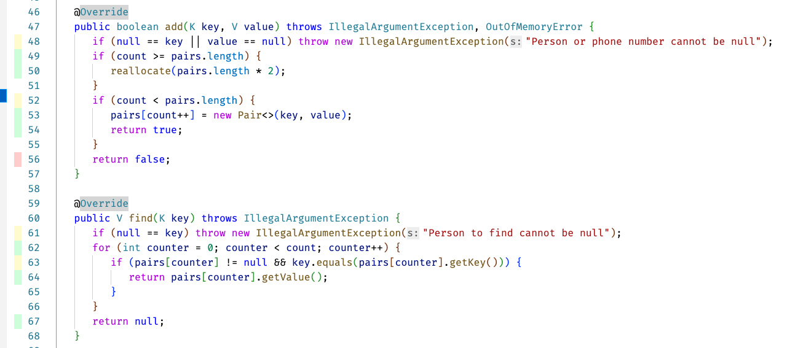

# 67-phonebook Phonebook task

Data structures and algorithms 2022.

In this task you will implement to fast data structures, hash table and a binary search tree. Tests will read phone books to these data structures. Both of these will implement a `Dictionary` interface.

Several programming languages have a dictionary container (for example, [Swift](https://swiftdoc.org/v2.2/type/dictionary/)), other programing languages call it a "map" (for example [Java](https://docs.oracle.com/javase/8/docs/api/java/util/Map.html)).

> Note that Binary Search Tree, BST is a *data structure* and related algorithms. It *is not* the same thing as binary search. So do not implement a binary search in this exercise!

Phone book files have names (first name, last name) and phone numbers (country, area code, phone number):

```
Bony Danar Krish,Dürer,372,050,7020307
Hilja Yann Malachai,Magritte,212,045,7020315
Rholmark Richard Eira,Manet,39,040,7020329
Findlay-James Lisandro Callin,van Rijn,380,042,7020369
Cahlum Umair Jace,Thesleff,33,045,7020308
Zaaine Jazeb Stuart,Rivera,39,042,7020325
Loui Jaida Bowie,Dali,372,020,7020393
```

A phone book file can have persons with the same name. Here, you will implement the dictionaries so that the key value (Person) has to be unique in the dictionary. This is obviously not the fact in the Real World. Here we'll make this assumption to keep the task getting too complicated and challenging. So if the phone book test files contain the same person (name) twice, implement the dictionaries so that the **last one added** should be stored in the dictionary.

> Many languages have e.g. MultiMaps, that do allow having same key value twice in a container. We will stick to a simple implementation in this course, having only one unique key per dictionary.

Tests use different size phonebooks to test the correctness of your code. Additionally, `PerformanceTests` fills the phonebooks with different sizes of phonebooks, larger and larger. So then you'll be able to estimate the time complexity class of your implementation in a real computer; in practice, the speed of execution.

Since the phone book files can be large, **consider that** when designing and implementing your algorithms and data structures:

* It will be a good idea to use hash values in calculating indices to array and comparing objects.
* Think about and experiment with different **hash functions** -- which function gives you the best result in avoiding collicions.
* Even though the phone books do not have two persons with a same name, the hash generated from the name can be the same with two different persons. So you need to handle collisions in both implementations.
* With BST do not limit the hash value to a  positive integer with some artificial upper limit value. This is needed only with hash table, not with BST. Here the hash can be whichever possible integer value.
* Avoid doing things that are not necessary. For example, with BST it is not necessary to first search if the person is in the tree, and then add it if it cannot be found. Just add it there. Do not create objects until you know that it is actually necessary, to avoid allocations.


## The goal

* The goal of this exercise is to create two implementations of a faster phonebook using both a **hash table** *and* a **binary search *tree*** (BST).

After the implementation, **write** also a report about this task. More information about this at the end, in the Delivery section.

* The implementation must pass all the tests included in the exercise.
* The data structure implementations must be generic.
* When done, deliver your project as instructed in the course.

Note that binary search *tree* is a data structure with algorithms, and is *different* from the binary search *algorithm*. So do not try to implement binary search in this exercise. 

> Note that this is again a task where you **are not allowed to use** Java container classes (anything that implements `Collection` or `Map` directly or indirectly) or algorithms from classes `Arrays` or `Collections`. All data structures and algoritms *will be implemented by yourself* using plain Java arrays and classes you implement in this course. You obviously may use the basic data types int, Integer, String, etc., and arrays [] of these -- and the code you have implemented previously in this course.

## Prerequisites

You have all the tools installed and working. This was tested in the `00-init` exercise  of the course. If you haven't done that yet, do it now.

You will need the `Algorithms.fastSort` method you implemented in `05-invoices` in this exercise. So **copy that file** from the previous exercise (`05-invoices`) to the source code directory of this exercise.

## Step 1 - Analysing slow data structure performance

The structure of the exercise is shown below in an UML class diagram.


The project includes a class `KeyValueArray`. It implements the `Dictionary` interface and is used by the tests for storing phone numbers and names of persons. A test data file `Phonebook.txt` is included, and the tests read that file of 62 691 person entries into the `KeyValueArray`. The key in the array is the `Person` object and value in the array is the `PhoneNumber` object. Thus we can search for the key and find their phone number, using the dictionary.

**Note** that this implementation uses your algorithms implemented in the `Algorithms` class:

* `KeyValueArray.toSortedArray()` calls your fast sorting algorithm `Algorithms.fastSort()` - you implemented this in exercise task `05-invoices`.
* `KeyValueArray.compress()` that compress the nulls away from the array, and makes the array smaller to reduce memory consumption, calls your implementation of `Algorithms.partitionByRule()` - you did this in exercise `03-draw`.

So you will use these and other algorithms you have already implemented. If there are any bugs in these, you must obviously fix them before continuing with this exercise.

A data structure containing key-value pairs are often called by the name dictionary. Often also the term map is used, since the key "maps" to a value.

**Execute** the tests for testing the performance of the `KeyValueArray` implementation:

```command
mvn -Dtest=PhoneBookTests#slowPhoneBookTests test
```
Note that other tests at this point will fail, so run only the test indicated above!

Run the test *several times* to see the time it takes to:

* Fill the phonebook, implemented with `KeyValueArray`, from the test data file.
* Do *linear search* to find the test persons (four searches done).

**Study** the code in `KeyValueArray` to see how data is added to the array and how linear search is done.

**Note** that the internal array needs to be reallocated if the data does not fit in as new data items are added to the `KeyValueArray`. **Study** how it is done.

**Study also closely**, in addition to the `Dictionary` interface and the implementation of it in the `KeyValueArray` class, also classes `Person`, `PhoneNumber` and `Pair`, since you will need them also in your own implementation!

## Step 2 - Prerequisites for implementing hash table and BST implementations

You need to finish implementation of the `Person` class before you can start working on the data structures. 

The `hashCode` method need to be implemented as well as the `compareTo` method. In implementing these methods you **must** use both member variables (first and last names) when comparing `Person` objects and calculating the hash values. A basic rule in Java is that the methods `hashCode`, `compareTo` and `equals` should use the same member variables to determine equalness, identity and comparisons. You can see that `Person.equals()` does exactly this.

**Why** do you need to implement these methods? Because:

1. The hash table and BST need to be able to compare the keys in these data structures. Person acts as the key, and PhoneNumber as a value. Comparing integers is much faster than comparing strings.
2. To be able to use hash tables and implement efficient BST:s, *hashing* is needed to identify objects and calculate indices for objects to be placed in the array.

In the next section below, the `hashCode` you implement will be used in your hash table to determine an index to the hash table where the object is placed or can be found from. See details from the course lectures.

You will also use the key's (`Person`'s) `hashCode` also in the BST implementation to quickly navigate the BST tree. See the lecture demonstration why you should use integers instead of Strings when navigating the BST nodes when a) searching for the place where to insert the object and b) searching for an object with key from the tree and return the associated value.


## Step 3 - Instructions for implementing hash table and BST 

> **NB**: when implementing the binary search tree, you will need **new helper classes** using which you will define the structure of the tree. You will need classes to define the tree node, and the tree itself! Note that in BST, you will **not** use arrays. For traversing the tree, you may implement algorithms as shown in the lectures (preorder, inorder, postorder), and/or implement the [Visitor](https://en.wikipedia.org/wiki/Visitor_pattern) design pattern. You may then use the visitor to, for example, pick the elements from the tree into an array and then sort it. You may also take a look at a similar [BST example](https://github.com/anttijuu/BooksAndWords/tree/main/BSTree/Sources/BSTree) implemented in Swift programming language.

You will now implement two faster data structures as *generic classes*, following the example set by the `KeyValueArray` which is also generic.

1. The `KeyValueHashTable` class must implement a *hash table* to hold and search for items.
2. The `KeyValueBSearchTree` class must implement a *binary search tree* to hold and search for items.

> Note that the given skeleton code has the method `getType()` and as long as the method returns `Type.NONE`, the two implementations are not tested. So when you are ready to test these, change the return value to return the correct type (either `HASHTABLE` or `BST`) of the dictionary.

So, you can **first** implement one of the two data structures, change the return value of `getType()` to return the enum value of that data structure, and then test it. The other data structure is not tested and you may focus only on the one you work on. Then when you have implemented the other too, change that one's `getType()` return value so the tests will then also test that implementation!

As you implement these as generic classes, they can hold *any* Java objects as long as:

* The *key*, a generic type `K` *implements* the `Comparable` *interface*.
* The *value* `V` to store associated with each key, any Java class with no interface requirements.

The `PhoneBookTests` will treat the already implemented `KeyValueArray` and the two classes you implement, as `Dictionary` types:

```Java 
    static Dictionary<Person, PhoneNumber> slowPhoneBook = null;
    static Dictionary<Person, PhoneNumber> fastHashTablePhoneBook = null;
    static Dictionary<Person, PhoneNumber> fastBSTPhoneBook = null;
...
    slowPhoneBook = new KeyValueArray<>();
    fastHashTablePhoneBook = new KeyValueHashTable<>();
    fastBSTPhoneBook = new KeyValueBSearchTree<>();
```
This is because (as you can see from the class declarations) they *all implement* the *generic* `Dictionary` *interface*. 

Make sure you **do not use** the classes `Person` and `PhoneNumber` in your code when implementing `KeyValueHashTable`and `KeyValueBSearchTree`-- otherwise your implementations are *not generic*, but tied to these two classes. Only use the `K` and `V` template parameters as data object types. 

Look at the `KeyValueArray` as an example -- it **does not mention** `Person` and `PhoneNumber` classes **at all**. It only uses the `compareTo` from `Comparable` interface and `hashCode` and `equals` inherited and overridden from `Object`. These must be implemented by the template parameters `K` and `V`.

Your implementation should meet the following **goals**:

* No crashing, exceptions, index out of bounds errors, lost or duplicate data.
* Searching nor adding should not get stuck in a loop running forever.
* All entries from the test file are added to the phonebook.
* Your `KeyValueHashTable` implementation supports internal array reallocation similarily as the `KeyValueArray` does, but considering the special characteristics of hash tables. 
* Your implementations are able to return the contents of the `Dictionary` implementation as a sorted array (using **your fast sorting algorithm** implemented in `Algorithms` class in exercise `05-invoices`).
* `toSortedArray()` and `compress()` methods use the existing algorithms you implemented following the example in `KeyValueArray`. Note, however, that the implementations should be different in hashtable and BST (especially BST). Consider the **characteristics** of these data structures here.
* The faster data structures are really significantly faster than the slow `KeyValueArray` implementation.

When implementing reallocation and compressing, remember that when the internal array length changes in `KeyValueHashTable`, you **must calculate new indices** for the elements in the array. Remember from the lectures that the indices are calculated so that they depend on the array length! So whenever the array length changes, the indices for the elements in the hashtable **must be recalculated**.

For testing, **add** code to `getStatus()` to print out any interesting data from your implementation. For example, if you implemented this using hash tables, use a counter to calculate how many collisions happened when adding persons to the hash table. When implementing the BST, print out the maximum depth of the tree when elements were added to the tree.

An example of what to print:

```console
KeyValueArray reallocated 12 times, each time doubles the size
KeyValueArray fill rate is 76,53%
Hash table fill factor is 0,80
Hash table had 39195 collisions when filling the hash table.
Hash table had to probe 53 times in the worst case.
Hash table had to reallocate 12 times.
Current fill rate is 34,01%
Tree has max depth of 38.
Longest collision chain in a tree node is 1.
```

Tests in `PhoneBookTests` call `getStatus()` so you can then see the output and can evaluate your implementation quality. For example, if you have quite a many collisions, you can adust the fill factor of your hash table or try to change your hash function so that you would have less collisions when filling the table.

With the BST, you can see that the max dept of the tree branches here was 38. It tells you how many comparisons at worst needs to be done when inserting or searching from the tree. The implementation giving the printout uses linked lists in BST to  handle collisions, so that's why itn prints out the length of the longest linked list. Luckily this is only one length list, so the hash code must be good in avoiding collisions.

## Testing 

**Run the PhoneBookTests** to make sure your implementation passes the unit tests. From command line, you can execute the tests (in the directory that contains the exercise `pom.xml` file):

```
mvn -Dtest=PhoneBookTests test
```

If the tests do not pass, you will see errors. Otherwise you will see that the tests succeed. If you have issues, fix your implementation and try again.

To make sure your implementation is really generic, execute also the `GenericTests` test:

```
mvn -Dtest=GenericTests test
```

These tests use `String` as the key `K` to the `Dictionary`, and `Integer` as the value `V`. Your implementation should work with these too, since these classes implement the `Comparable` interface, `hashCode()` and `equals()`! The `GenericTests` also test the implementation of your `toSortedArray()` methods. If they fail to return sorted elements in the original test data order, you must revise your implementation.

**Finally** execute the `PerformanceTests`.

The amount of test data is so large that those files are not included in this repository. **Download** The test data file `towns.zip` using this link:

https://drive.google.com/file/d/1WA6YDWN-5QGHnK7sAIfNT9cUA3wl6oSY/view?usp=sharing

 **Unzip** `towns.zip` contents to the **root directory of this exercise**, so that tests can find the files. **DO NOT ever never add these test files to git!!!**

The test prints out the information from `getStatus()` methods. Use these when you analyse the implementation and performance of your dictionaries, and report your observation and analysis in the `REPORT.md` in the root directory of the repository. Additionally, this test creates a file `compare.csv` that has data on executing the test files, e.g. the number of elements (persons) in the dictionary per test file, and the time taken to add the elements to the dictionaries. Check out from the **Delivery** section what you should include in the report.

Here you can see the `PerformanceTests` names of the test files read by this test, and the number of persons in each test file:

| File           |  Population   |
|----------------|--------------:|
| village.txt    | 100           |
| small-town.txt | 1000          |
| town.txt       | 10 000        |
| large-town.txt | 50 000        |
| city.txt       | 100 000       |
| large-city.txt | 500 000       |
| metropolis.txt | 1 000 000     |
| capital.txt    | 2 000 000     |
| megalopolis.txt| 5 000 000     |


When working with this exercise, **do not**:

* Change the test classes in any way.
* Change the input data file `PhoneBook.txt` in any way.

You only need to change the `Person.java`, `KeyValueHashTable` and `KeyValueBSearchTree` files in this exercise.


## Delivery

**Remember** to add any new code files and the report file (instructions below) to git.

Open the file created by the `PerformanceTests` -- `compare.csv` in MS Excel, Apple Numbers, Google Sheet, or similar. Create a graph depicting (scatterplot works well) that shows visually the relationship of execution time to the n (number of elements in the phonebook). **Add** this graph as a picture file to the report and git.

**Write** a report on your implementation in a markdown text file `REPORT.md` that you can find in the root directory of this repository. Evaluate the correctness and time complexity of your implementation:

* Which kind of **hash functions** did you try out for calculating the hashes? Did some functions produce better hashes than others? E.g. more collisions or less collisions in filling the hash table?
* What **fill factors** did you use when creating and reallocating the arrays? Was the performance better with some fill factors?
* How much did you **grow the hash table** when reallocation needed to be done? What was the impact on performance with different solutions? Was the table finally having very much empty (null) objects and was thus wasting memory, perhaps too much?
* **How deep** did the BST get when filling it with data? Any difference when using different hash functions to generate the hashes (keys for the tree nodes)?
* Which techniques for handling **collision** did you use in both data structures? Did you try out different techniques, and why did you select the one in the implementation?
* When trying out different solutions, did you see significant differences in what was printed out in the `getStatus()` method? What do you print out there, and does it somehow describe the goodness of these implementations?
* Which fast **sorting algorithm** did you implement in `05-invoices` and used here? Did you try out if some other sorting algorithm could have performed faster with this data set? Would quicksort be slower or faster than heapsort? Did you have to increase the stack or heap size to make this work?
* **Finally**, give also feedback about the course, course exercises and about meeting the learning goals for the course. Please tell if there is anything you would change to make this course better.

If you want to do some of the optional tasks, do that also before the course deadlines.

Deliver the exercise as instructed in the course, after your tests pass and your implementation meets the goals. Remember to **double check** that all necessary files from all course tasks have been added to the git and changes have been committed, before pushing the final delivery to your remote repository.

## Extra

This project's `pom.xml` has been configured to analyse the test coverage.

You can see the coverage from VS Code editor, if you:

1. install the VS Coden extension Coverage Gutters,
2. build the project using the command below,
3. take a look at the code editors to see the code coverage (screenshot below).

```console
mvn jacoco:prepare-agent package jacoco:report
```

Additionally, in the VS Code window, in the blue bar at the bottom, there is a "Watch" button. By clicking on that button, the text changes to "Coverage". Now, when you open a Java code file, one of the source files that are tested (not the test files), you will see the coverage of the tests.

In this image, the green shows good test coverage lines, while red lines have not been executed by the tests. For example, the class `KeyValueArray` method `add` on line 56, returning false when element was not added to the array successfully, has not been executed. On the other hand, this shows that the addition has always succeeded.




## Questions or problems?

Participate in the course lectures, exercises and online support group.

## About

* Course material for Tietorakenteet ja algoritmit | Data structures and algorithms 2022.
* Study Program for Information Processing Science, University of Oulu.
* (c) Antti Juustila, INTERACT Research Group.
