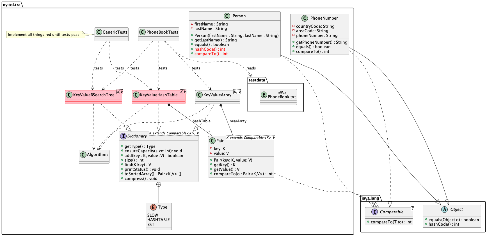
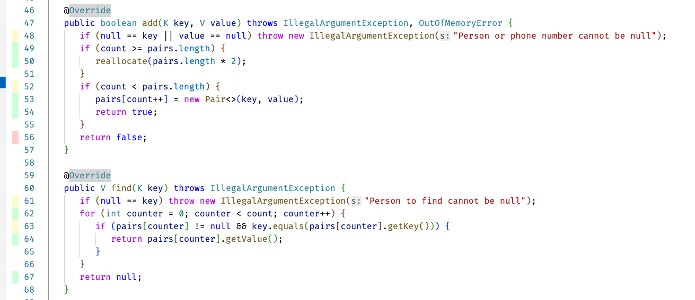

# 67-phonebook Puhelinluettelo

Harjoituksessa toteutetaan **kaksi** nopeaa tietorakennetta (hajautustaulu ja binäärinen hakupuu) joihin luetaan tiedostoista puhelinluetteloita. Nämä molemmat toteuttavat `Dictionary` -rajapinnan. 

Useissa ohjelmointikielissä löytyy myös Dictionary niminen tietosäiliö (esimerkiksi [Swift](https://swiftdoc.org/v2.2/type/dictionary/)), toisissa ohjelmointikielissä sitä kutsutaan nimellä "map" (esimerkiksi [Java](https://docs.oracle.com/javase/8/docs/api/java/util/Map.html)).

> Huomaa että binäärinen haku*puu* (Binary Search Tree, BST) on *tietorakenne* ja siihen liittyviä algoritmeja. Se *ei ole* sama asia kuin puolitushaku eli binary *search*. Joten älä toteuta tässä harjoituksessa puolitushakua!

Puhelinluetteloissa on nimiä (etunimet, sukunimi) ja puhelinnumeroita (maa, suuntanumero, puhelinnumero):

```
Bony Danar Krish,Dürer,372,050,7020307
Hilja Yann Malachai,Magritte,212,045,7020315
Rholmark Richard Eira,Manet,39,040,7020329
Findlay-James Lisandro Callin,van Rijn,380,042,7020369
Cahlum Umair Jace,Thesleff,33,045,7020308
Zaaine Jazeb Stuart,Rivera,39,042,7020325
Loui Jaida Bowie,Dali,372,020,7020393
```

Yhdessä puhelinluettelotiedostossa voi olla useampi saman niminen henkilö. Toteutamme nämä tietorakenteet kuitenkin samalla tavalla kuin monien ohjelmointikielten vastaavat "dictionary" tai "map" -tietorakenteet -- yhdessä Dictionaryssä voi olla sama avaimen arvo (henkilön nimi) **vain kerran**. Toteutuksesi tulee siis toimia siten että jos saman nimisiä henkilöitä lisätään tietorakenteeseen, **uusin lisätty korvaa aina edellisen**, jos sellainen oli jo tietorakenteessa.

> Jos haluttaisiin toteuttaa paremmin todellisuutta vastaava tietorakenne, sen nimi olisi esimerkiksi `MultiMap`. Tämän toteuttaminen on kuitenkin vaikeampaa, joten tässä rajaudumme sellaisiin `Dictionary` -tietosäiliön toteutuksiin joissa avaimen arvo voi olla vain kerran. Tämä on kuitenkin hyvä painaa mieleen, sillä "oikeassa" maailmassa ja oikeissa tietosäiliöluokissa tämä ero näkyy.

Testit käyttävät eri kokoisia puhelinluettelotiedostoja testaamaan oikeellisuutta. Lisäksi `PerformanceTests` testi täyttää tietorakenteet vuorotellen yhä isommilla ja isommilla puhelinluetteloilla. Näin voidaan arvioida n:n kasvaessa toteutusten aikakompleksisuusluokkaa todellisella tietokoneella käytännössä siis suorituskykyä ajan suhteen.

Koska tietomäärät ovat isoja, **ota tämä huomioon** algoritmeja ja tietorakenteita suunnitellessasi:

* Sekä hajautustaulussa että binäärisessä hakupuussa kannattaa käyttää tiivisteitä (hash) indeksien laskemiseen ja olioiden nopeaan vertailuun.
* Mieti ja kokeile erilaisia **tiivisteitä** (hash) laskevia **funktioita** -- mikä antaa parhaamman tuloksen törmäysten (collision) välttämiseksi.
* Vaikka luetteloissa ei ole samannimisiä ihmisiä, nimistä laskettu tiiviste voi olla kahdella ihmisellä sama. Varaudu siis molempien tietorakenteiden toteutuksessa huolehtimaan törmäyksistä. 
* BST:n tapauksessa, älä turhaan typistä hajautusavainta positiiviseksi kokonaisluvuksi jolla on joku keinotekoinen maksimiarvo. Tämä on tarpeen *vain* hajautustaulussa, mutta ei BST:ssä. BST:ssä avain saa olla minkälainen kokonaisluku tahansa.
* Vältä turhien asioiden tekemistä tilanteissa joissa asiaa ei tarvitse tehdä. Esimerkiksi binäärisessä hakupuussa ei ensin kannata etsiä onko ihminen jo puussa ja sitten lisätä sitä sinne. Tämä johtaa siihen että puu täytyy käydä läpi kahdesti, joka tuplaa toteutuksen aikakompleksisuuden. Älä luo oliota ennenkuin on varmaa että se on tarpeen, sillä muistin allokointi on hidasta.


## Tavoite

* Tavoitteena on tehdä *kaksi* erillistä toteutusta puhelinluettelosta, toteuttaen sekä **hajautustaulu** (hash table) *että* **binäärinen haku*puu*** (binary search *tree*, BST).

**Laadi** myös lopuksi toteutuksestasi **raportti** jossa arvioit toteutuksesi oikeellisuutta ja aikakompleksisuutta. Alempana kerrotaan esimerkiksi siitä että toteutuksiesi pitää sisältää metodi `getStatus()`, jonka palauttama merkkijono voidaan tulostaa ja siitä saadaan tietoa tietorakenteiden toiminnallisuudesta ja toteutuksen tehokkuudesta. Raportista enemmän lopussa "Arviointi" -luvussa.

* Toteutusten täytyy läpäistä kaikki testit.
* Toteutusten tulee olla **geneerisiä**, eli toimivat kaikilla tietotyypeillä (joiden avainarvo toteuttaa `Comparable` -rajapinnan).
* Kun olet valmis, palauta tehtävä kuten kurssilla on ohjeistettu.

> Huomaa myös että tässä(kään) tehtävässä **ei saa käyttää** Javan tietosäiliöluokkia (`Collection` ja `Map` -rajapintojen toteutukset) tai algoritmeja luokissa `Arrays` ja `Collections`. Kaikki tietorakenteet ja algoritmit *toteutetaan itse* käyttäen Javan tavallisia taulukoita ja omia luokkia sekä Javan perustietotyyppejä int, Integer, String, ja niin edelleen.

## Edeltävyydet

Työkalut on asennettu ja toimivat.

Tarvitset harjoituksen `05-invoices` nopeaa lajittelualgoritmiasi `Algorithms.fastSort` tässä tehtävässä. Samoin tässä hyödynnetään harjoituksessa `03-draw` toteuttamaasi algoritmia `Algorithms.partitionByRule()`. 

Joten **kopioi** kyseinen lähdekooditiedosto edellisestä harjoituksesta (`05-invoices`) tämän tehtävän lähdekoodihakemistoon.

## Vaihe 1 - Hitaan tietorakenteen suorituksen analysointi

Harjoituksen rakenne näkyy alla olevassa UML -luokkamallissa. Toteutat kaikki punaisella merkityt metodit ja luokat. Noudata alempana ohjeissa olevaa vaiheiden järjestystä!



Projektissa on luokka `KeyValueArray`. Se toteuttaa rajapinnan `Dictionary`, ja sitä käytetään testeissä tallentamaan henkilöiden tietoja ja puhelinnumeroa. Testidatatiedosto `Phonebook.txt` on myös projektissa. Testit lukevat tiedostosta 62 691 henkilön tiedot tietorakenteeseen `KeyValueArray`. Avaintietona (key) taulukossa on `Person` -olio, ja arvona `PhoneNumber` -olio. Näin ollen on mahdollista avaimen avulla etsiä tietyn henkilön puhelinnumero tästä taulukosta.

Avain-arvo -pareja sisältäviä tietorakenteita kutsutaan usein nimellä hakemisto (dictionary), joskus käytetään myös termiä map joka viittaa siihen että avaimen arvo "mäpätään" johonkin toiseen arvoon.

**Huomaa** että `KeyValueArray`, tämä yksinkertainen rajapinnan `Dictionary` -toteutus, käyttää `Algorithms` luokkaan toteuttamiasi algoritmeja:

* `KeyValueArray.toSortedArray()` kutsuu toteuttamaasi nopeaa lajittelualgoritmia `Algorithms.fastSort()` - toteutit tämän harjoituksessa `05-invoices`.
* `KeyValueArray.compress()` joka tiivistää taulukosta null:t pois ja pienentää taulun tilaa turhan muistinkulutuksen välttämiseksi, kutsuu toteutustasi partitiointialgoritmista metodissa `Algorithms.partitionByRule()` - toteutit tämän harjoituksessa `03-draw`.

Hyödynnät näitä aikaisemmin toteutettuja algoritmeja, kun toteutat myöhemmin alempana ohjeistetulla tavalla hajautustaulukon ja binäärisen hakupuun. Jos näissä `Algorithms` -luokan algoritmeissasi on bugeja, ne tietysti pitää korjata koska muuten niitä ei voi tässä hyödyntää.

**Suorita** testit joilla testataan `KeyValueArray` -toteutusta:

```command
mvn -Dtest=PhoneBookTests#slowPhoneBookTests test
```
Huomaa että muut testit eivät tällä hetkellä välttämättä mene läpi, joten aja **vain** yllämainittu testi!

Suorita testi *useita kertoja* jotta voit havainnoida kuinka kauan kestää:

* Täyttää puhelinluettelo tiedostosta, kun toteutuksena on `KeyValueArray` (hidas eli "slow" toteutus).
* tehdä *lineaarinen haku* kun etsitään testihenkilöitä aineistosta.

**Tutki** koodia luokassa `KeyValueArray` ja katso kuinka tietoelementtejä lisätään taulukkoon ja kuinka lineaarinen hakualgoritmi on toteutettu.

**Huomaa** että luokan `KeyValueArray` sisäinen taulukko vaatii uudelleen allokointia (*reallocation*) kun elementeille varattu tila loppuu kesken. **Tutki** miten uudelleen allokointi on toteutettu. Tämä pitäisi olla tuttua asiaa stack ja queue -harjoituksista.

**Tutki tarkkaan** `Dictionary` -rajapinnan ja sen toteutuksen `KeyValueArray` lisäksi myös luokkia `Person`, `PhoneNumber` ja `Pair`, sillä käytät niitä myös omissa toteutuksissasi!


## Vaihe 2 - Mitä pitää tehdä ennen hajautustaulua ja BST:tä

Ennen kuin voit toteuttaa hajautustaulun tai BST:n, **`Person` luokan toteutus täytyy viimeistellä**. Metodi `hashCode` on toteutettava, samoin kuin `compareTo` metodi. 

**Miksi** nämä metodit tulee toteuttaa? Koska:

1. Sekä hajautustaulussa että BST:ssä pitää voida nopeasti vertailla näitä olioita toisiinsa, varsinkin avainarvona käytettävää `Person` -olioita. Tiiviste - joka on kokonaisluku - on **paljon nopeampi** vertailuissa kuin merkkijonojen vertailu.
2. Jotta olioita voitaisiin käyttää edistyneissä tietorakenteissa, on voitava laskea jokaiselle oliolle mahdollisimman yksikäsitteinen *tiiviste* eli *hash* jota hyödynnetään sekä hajautustauluissa **indeksien laskemiseen** että BST:ssä olioiden **nopeaan vertailuun** tiivisteen avulla.

Kun toteutat näitä metodeja, käytä hyväksi **molempia** jäsenmuuttujia etu- ja sukunimi, kun verrataan `Person` -olioita toisiinsa ja lasketaan person -olion tiivistettä (hash). Javan perussääntö on että luokan metodien `hashCode`, `compareTo` ja `equals` tulisi pääsääntöisesti käyttää samoja jäsenmuuttujia kun arvioidaan luokan olioiden yhtäsuuruutta, järjestystä ja identiteettiä (tiiviste). Huomaa kuinka `Person.equals()` -metodissa näin tehdäänkin.

Seuraavassa vaiheessa 3 käytät tässä toteuttamaasi `Person` luokan `hashCode` -metodia laskemaan mihin indeksiin taulukossa person -olio kuuluu, ja mistä indeksistä sitä voisi etsiä. Luennoilla kerrotaan tästä lisää hajautustaulujen yhteydessä, joten varmista että olet niihin tutustunut/osallistunut luennoille/lukenut lisää.

**Käytät tätä avaimen** (`Person` on dictionaryssä avaintieto, "key") metodia `hashCode` **myös BST -toteutuksessa** siihen että a) puussa voidaan nopeasti navigoida oikeaan haaraan kun uusi solmu lisätään puuhun, vertailemalla hajautusavaimen arvoja tai b) kun etsitään avaimesta lasketun hajautusavaimen perusteella onko puussa kyseiseen avaimeen liittyvää arvoa. 

Luennoilla on demottu sitä miksi numeerisen avaimen avulla tehtävä puusta etsiminen on merkittävästi nopeampaa kuin merkkijonojen avulla (henkilön nimi) tapahtuva etsiminen. **Älä siis käytä** puussa(kaan) avainarvona henkilön nimeä, vaan `Person.hashCode()`n avulla laskettua tiivistettä. 

Toki sitten kun olet löytänyt saman hajautusavaimen arvon, ennen kuin "päätät" että tämä on tosiaan sama Person, vertaat myös `.equals()` metodilla että onko tällä saman hajautusavaimen omaavalla henkilöllä oikeasti sama nimi. Kuten todettua, eri nimisillä ihmisillä *voi* olla sama hajautusavaimen arvo. Luonnollisestikin kahdella samannimisellä henkilöllä on taas *sama* hajautusavaimen arvo.


## Vaihe 3 - Ohjeet hajautustaulun ja BST:n toteutukseen

> **HUOM**: kun toteutat binääristä hakupuuta, tarvitset **uusia apuluokkia** joiden avulla puutietorakenne toteutetaan. Esimerkiksi puuta ja solmua kuvaavat luokat ovat todennäköisesti erittäin tarpeellisia. BST:ssä **ei käytetä** taulukoita! 

Puun läpikäyntiin voit toteuttaa algoritmeja luentojen kuvaamalla tavalla (preorder, inorder, postorder) tai toteuttaa vaikkapa [Visitor](https://en.wikipedia.org/wiki/Visitor_pattern) -suunnittelumallin jolla voit poimia puusta elementtejä esimerkiksi taulukkoon (metodi `toSortedArray()`). Visitor -suunnittelumallista bst:n yhteydessä voit halutessasi [tutkia myös Swift:llä toteutettua esimerkkiä](https://github.com/anttijuu/BooksAndWords/tree/main/BSTree/Sources/BSTree).

**Tutustu huolella** `Dictionary` -rajapinnan toteutukseen ja esimerkkitoteutukseen `KeyValueArray`. **Noudata** `Dictionary`:n koodin kommenteissa olevia ohjeita!

Toteutat tässä vaiheessa kaksi nopeampaa toteutusta (hajautustaulu ja binäärinen hakupuu) *geneerisinä luokkina*, seuraten esimerkkinä annettua `KeyValueArray`-luokkaa joka on myös geneerinen:

1. Luokan `KeyValueHashTable` tulee toteuttaa **hajautustaulu** (hash table) jonka avulla avain-arvopareja pidetään muistissa ja haetaan avaimen perusteella haetun tiivisteen avulla.
2. Luokan `KeyValueBSearchTree` tulee toteuttaa **binäärinen hakupuu** (BST) joka toteuttaa nopeamman tavan tallentaa ja hakea avain-arvopareja kuin `KeyValueArray`-luokka, ilman taulukoita.

> Huomaa että näiden runkona valmiina annettujen luokkien metodit `getType()` palauttavat arvon `Type.NONE`, joka saa aikaan sen että testit **eivät testaa** näitä luokkia **jos** paluu arvo on tuo. Kun olet saanut näiden luokkien toteutuksen siihen kuntoon että olet valmis testaamaan niitä, sitten **muuta** luokkien tai luokan metodin palauttama arvo luokasta riippuen joko `Type.HASHTABLE` tai `Type.BST`.

Voit siis **ensin** toteuttaa näistä tietorakenteista toisen, muuttaa sen `getType()` -metodin palauttamaan kyseisen tietorakenteen tyypin, ja testata sitä. Testit kun eivät suorita luokan testiä jos sen `getType()` palauttaa arvon `Type.NONE`. Kun olet saanut toisen tietorakenteista toimimaan, voit sitten toteutta sen toisen näistä tietorakenteista ja muuttaa senkin `getType()`:n palauttamaan tietorakennetta vastaavan enum -arvon.

Kun toteutat nämä tietorakenteet geneerisinä, ne voivat pitää sisällään mitä tahansa Java -olioita kunhan vaan:

* *avain* jonka geneerinen tyyppi on K, *toteuttaa* rajapinnan `Comparable` ja ylikuormittaa `Object` luokan metodin `hashCode()`.
* *arvo* `V` joka liittyy jokaiseen avaimeen, voi olla mikä tahansa Javan luokka ilman mitään erikoisvaatimuksia rajapointojen suhteen.

Testi `PhoneBookTests` kohtelee jo toteutettua `KeyValueArray` luokkaa ja kahta sinun toteuttamaasi luokkaa niiden rajapinnan mukaisesti `Dictionary` -olioina:

```Java 
    static Dictionary<Person, PhoneNumber> slowPhoneBook = null;
    static Dictionary<Person, PhoneNumber> fastHashTablePhoneBook = null;
    static Dictionary<Person, PhoneNumber> fastBSTPhoneBook = null;
...
    slowPhoneBook = new KeyValueArray<>();
    fastHashTablePhoneBook = new KeyValueHashTable<>();
    fastBSTPhoneBook = new KeyValueBSearchTree<>();
```
Koska -- kuten luokkien esittelyistä näet -- ne *kaikki toteuttavat geneerisen* `Dictionary` *rajapinnan*, niihin voidaan viitata `Dictionary<K,T>` olioina. 

**Varmista**, että kun koodaat toteutustasi, että **et missään koodissasi käytä** luokkia `Person` tai `PhoneNumber` kun toteutat luokkia `KeyValueHashTable`and `KeyValueBSearchTree`-- muuten toteutuksesi *ei ole geneerinen* vaan sidottu näihin kahteen konkreettiseen luokkaan. Käytä ainoastaan template parametreja `K` ja `V` ja niissä olevia metodeja (`Comparable` -rajapinnasta ja `Object` -luokasta ylikuormitettuja). 

Katso vaikka esimerkkinä `KeyValueArray` -luokkaa -- se **ei missään käytä** `Person` ja `PhoneNumber` luokkia. Se käyttää vain geneerisen template -parametrin `K` metodia `compareTo` joka tulee `Comparable` rajapinnasta, ja `hashCode` sekä `equals` metodeja jotka on peritty `Object` -luokasta ja uudelleenmääritelty konkreettisessa luokassa `Person`.

Toteutuksesi **tavoitteet** ovat:

* Toteutukset **noudattavat annettuja ohjeita** ja **toteuttavat** Dictionary<K,V> -rajapinnan siitä **mitään** muuttamatta.
* Testien suoritus ei kaada ohjelmaa, aiheuta odottamattomia poikkeuksia, indeksit eivät mene yli taulukon rajojen, dataa ei häviä eikä kopioidu.
* Lisäys- ja hakualgoritmit eivät jää pyörimään ikuisiin luuppeihin.
* Testiaineiston data tulee lisättyä tietorakenteisiin oikein, eikä ylimääräisiä dataelementtejä lisätä. Tietorakenteissa ei ole duplikaatteja avaimia (key, eli Person -olioita).
* Oma toteutuksesi `KeyValueHashTable` tukee sisäisen hajautustaulukkonsa reallokointia kuten `KeyValueArray` tekee, mutta huomioiden hajautustaulukoiden erityispiirteet reallokoinnissa (kts. luennot ja kommentti alla). 
* Toteutuksesi `Dictionary.toSortedArray()` -metodista hyödyntää omaa `Algorithms` -luokkaasi harjoituksessa `05-invoices` tekemääsi *nopeaa* lajittelualgoritmia.
* `toSortedArray()`:n ja `compress()` -metodien toteutukset hyödyntävät toteuttamiasi algoritmeja samalla tapaa kuin `KeyValueArray` -toteutus joka on annettu valmiina. Huomaa tosin että BST:n ja hajautustaulun toteutukset ovat erilaisia, ja ota tässä huomioon näiden tietorakenteiden **erityispiirteet** varsinkin `compress`:n tapauksessa.
* Tietorakenteet toimivat merkittävästi nopeammin kuin annettu `KeyValueArray` toteutus.

> Kun toteutat reallokointia ja compress:ia, ja `KeyValueHashTable`:n sisäistä taulukkoa pitää kasvattaa (tai pienentää), muista että elementeille hajautustaulussa on **laskettava uudet indeksit** uuteen erikokoiseen taulukkoon! Kuten luennoilta muistat, hajautustaulujen indeksit lasketaan siten että siinä huomioidaan taulukon koko. Kun taulukon koko muuttuu, elementtien indeksit voivatkin olla uudessa isossa taulukossa *erit*! Eli aina kun hajautustaulukon kokoa muutetaan, elementit **pitää sijoittaa sinne uuteen taulukkoon indeksit uudelleen laskien**, vanhasta taulukosta.

Testausta varten, **lisää** luokkiesi metodin `getStatus()` koodiin tietoa, jotka kertovat dataa toteutuksesi toimivuudesta. Esimerkiksi, kun olet toteuttanut hajautustaulun, palauta metodista merkkijono joka kertoo meille, kuinka monta törmäystä tapahtui elementtejä tauluun lisättäessä, ja kuinka monta askelta maksimissaan meni ennenkuin elementille löytyi vapaa paikka. Ja kun toteutat BST:n vastaavan metodin, voi tulostaa puun maksimisyvyyden jonne elementtejä käytiin lisäämässä. Jos käytät törmäysten hallintaan puussa esimerkiksi linkitettyjä listoja, tulosta tieto siitä, kuinka pitkä oli oli pisin linkitetty lista puussa kun törmäyksiä käsiteltiin. Tätä varten lisää sopivia jäsenmuuttujia toteutuksiisi joihin kirjaat näitä asioita, kun tietorakenteisiin lisätään elementtejä.

Esimerkki siitä mitä koodisi pitäisi tulostaa on tässä:

```console
KeyValueArray reallocated 12 times, each time doubles the size
KeyValueArray fill rate is 76,53%
Hash table fill factor is 0,80
Hash table had 39195 collisions when filling the hash table.
Hash table had to probe 53 times in the worst case.
Hash table had to reallocate 12 times.
Current fill rate is 34,01%
Tree has max depth of 38.
Longest collision chain in a tree node is 1
```
Mikäli jotain tuossa tulostuksessa on epäselvää, katso kurssimateriaalia ja kysy opettajilta lisätietoja.

Testit testiluokassa `PhoneBookTests` kutsuvat toteutuksesi `getStatus()` joten voit nähdä tulostuksesta tietoja siitä miten toteutuksesi toimii, ja arvioida esimerkiksi sitä onko esim. törmäyksiä liikaa suhteessa aineiston kokoon. Näin voit säätää esimerkiksi hajautustaulun kokoa (fill factor; kts. luennot) tai hajautusfunktiotasi ja katsoa tulisiko törmäyksiä vähemmän erilaisilla toteutuksilla.

BST -toteutuksessa taas puun maksimisyvyys kertoo jotain siitä, montako vertailua pahimmillaan pitää tehdä (esimerkissä 38) kun puuhun lisätään uusia elementtejä tai niitä etsitään sieltä. Collision chain taas viittaa siihen, että tässä toteutuksessa jos kahdella puuhun laitettavalla avaimella on sama hajautusavain, puun solmussa on linkitetty lista johon elementit samalla avaimella sijoitetaan. Pisimmillään tässä on onneksi ollut vain yksi olio linkitetyssä listassa, eli törmäyksiä on ollut vähän. Tämä kertoo hyvästä hajautusavaimesta.

## Testaus

**Suorita testi PhoneBookTests** ja varmista että testit menevät läpi. Komentoriviltä, hakemistossa jossa harjoituksen `pom.xml` tiedosto on:

```
mvn -Dtest=PhoneBookTests test
```

Näet virheilmoituksia jos testit eivät mene läpi. Korjaa mahdolliset ongelmat ja yritä uudestaan.

Jotta voisit varmistaa että toteutuksesi molemmista tietorakenteista on todella varmasti geneerinen, suorita `GenericTests` testit:

```
mvn -Dtest=GenericTests test
```

Nämä testit eivät käytä `Person` ja `PhoneNumber` -luokkia, vaan `String` on avain `K` ja `Integer` on avaimeen liittyvä arvo `V`. Toteutuksesi tulisi toimia myös näillä luokilla, sillä nämä toteuttavat `Comparable` rajapinnan sekä `hashCode()` ja `equals()` metodit!

Tämä `GenericTests` testi testaa myös toteutuksesi `toSortedArray()` ja `compress()` metodeja. Jos ne eivät palauta testiaineistoa täsmälleen vastaavaa oikein lajiteltua testiaineistoa, tai tilanne taulukon tiivistämisen jälkeen ei ole looginen, testit epäonnistuvat. Siinä tilanteessa korjaa koodisi ja testaa uudelleen.

**Lopuksi** suorita `PerformanceTests` -testit.

Testidataa on niin paljon että se ei ole mukana tässä repositoryssä. **Hae** testidatatiedosto `towns.zip` tämän linkin kautta:

https://drive.google.com/file/d/1WA6YDWN-5QGHnK7sAIfNT9cUA3wl6oSY/view?usp=sharing

 **Pura** `towns.zip` -tiedoston puhelinluettelot tämän harjoituksen **juurihakemistoon**, jotta testi löytäisi ne sieltä. **ÄLÄ missään tapauksessa lisää näitä testitiedostoja git:iin!!!**

Nämä testit tulostavat konsoliin `getStatus()` -metodin tietoja. Käytä näitä hyödyksesi kun teet toteutuksestasi analyysin joka raportoit repon juurihakemistossa olevaan `REPORT.md` -tiedostoon. Lisäksi tämä testi tulostaa tiedostoon `compare.csv` tietoja eri kokoisten tiedostojen käsittelystä, mm. elementtien lukumäärä tietorakenteessa per testitiedosto, ja aika joka meni tietoelementtien lisäämiseen tietorakenteisiin. Katso tarkemmin alta **Arviointi** -luvusta mitä raportin pitää sisältää.

Tässä `PerformanceTests` -testien lukemien puhelinluettelotiedostojen nimet ja ihmisten lukumäärä kussakin luettelossa:

| Tiedosto       |  Asukkaita  |
|----------------|------------:|
| village.txt    | 100         |
| small-town.txt | 1000        |
| town.txt       | 10000       |
| large-town.txt | 50000       |
| city.txt       | 100000      |
| large-city.txt | 500000      |
| metropolis.txt | 1000000     |
| capital.txt    | 2000000     |
| megalopolis.txt| 5000000     |


Kun työstät tätä harjoitusta, **älä**:

* muuta annettua Dictionary -rajapintaa,
* muuta testiluokkia millään tavoin,
* muuta testidatatiedostoa `PhoneBook.txt` millään tavoin.

## Arviointi

**Muista** lisätä uudet lähdekooditiedostot versionhallintaan komennolla `git add` ja lisätä muutetut tiedostot commit:lla, ja lopuksi päivittää etärepositorysi komennolla `git push`.

Avaa `PerformanceTests` -testin tulostama tiedosto `compare.csv` taulukkolaskinohjelmassa (MS Excel, Apple Numbers, Google Sheet, tms.). Laadi graafi (scatterplot) joka havainnollistaa suoritusajan suhdetta tietosäiliön sisältämien elementtien määrään (n). **Lisää** tämä graafi kuvakaappauksena raporttiin.

**Laadi** toteutuksestasi **raportti** tämän repositoryn päähakemistoon, tekstitiedostoon `REPORT.md` joka on jo olemassa valmiina. Voit käyttää tässä näiden ohjeiden mallin mukaan erilaisia otsikoiden yms. formatoiteja Markdown -syntaksilla. Sijoita myös kuvat raporttiin kuten tässä tiedostossa on tehty UML-kuvien kanssa. Arvioi raportissa toteutuksesi **oikeellisuutta ja aikakompleksisuutta**:

* minkälaisia **hajautusfunktioita kokeilit** tiivisteiden laskennassa? Tuliko joillakin enemmän törmäyksiä kuin toisilla hajautusfunktioilla?
* hajautustaulujen kanssa, minkälaisilla **täyttöasteilla** (fill factor) kokeilit taulukkoa? Nopeutuiko tai hidastuiko käyttö erilaisilla täyttöasteilla?
* kuinka paljon kasvatit hajautustaulun **kokoa** aina kerralla kun reallokointia tarvittiin? Nopeuttiko eri ratkaisut toimintaa ja/tai tuliko taulukosta tarpeettoman iso ja muistia tuhlaava (suurin osa siitä jäi tyhjäksi)?
* kuinka **syväksi** puu muodostui eri hajautusfunktioilla, vai oliko niillä merkitystä? Kokeilitko erilaisia hajautusfunktioita?
* Millä tavoin hoidit **törmäykset** hajautustaulussa ja BST:ssä? Kokeilitko erilaisia vaihtoehtoja, ja miksi valitsit sen mikä jäi toteutukseen?
* Tietorakenteiden toteutuksiesi pitää sisältää metodi `getStatus()`, joka tulostaa tietoa tietorakenteiden toiminnallisuudesta ja toteutuksesta. **Mitä** tässä tulostat ja miten mielestäsi palauttamasi toteutukset ovat parempia kuin muut kokeilusi, näiden tietojen perusteella mitä tulostat tuossa metodissa? Mitä voit sanoa näistä tulostetuista asioista suhteessa siihen mitä tässä olet analysoinut?
* **Minkä lajittelualgoritmin toteutit** `05-invoices` harjoituksessa, ja käytit tässä? Kokeilitko olisiko joku **toinen** lajittelualgoritmi **tehokkaampi** tämän aineiston kanssa? Olisiko heapsort ollut nopeampi kuin quicksort? Pitikö **pinon tai kekomuistin** kokoa kasvattaa jotta algoritmit ja tietorakenteet toimisivat?
* **Lopuksi**, anna myös **palautetta kurssista**, kurssin tehtävistä ja kommentoi kurssin oppimistavoitteiden saavuttamista omalta kohdaltasi. Kerro myös mitä kurssilla voisi mielestäsi muuttaa jotta se olisi parempi.

**Lisää** myös tämä raportti ja muut uudet tiedostot (kuvat) commitiin ja toimita sitten tehtävä git:n avulla etärepositoryysi arvointia varten. **Varmista kahdesti** ennen lopullista palautusta, että kaikki uudet tiedostot jotka ovat tarkistettavia töitä, on lisätty gitiin, commitoitu paikalliseen repoon ja työnnetty push:lla etärepositoryysi. Jos etärepostasi puuttuu tiedostoja tai ne eivät ole uusimmat versiot, työtäsi ei voi arvioida ja arvostella, tai arviointi perustuu väärään versioon.

Jos haluat tehdä valinnaisia tehtäviä, muista toimittaa nekin arvioitavaksi ennen kurssin deadlinea.

## Extraa -- Test coverage eli testien kattavuus

Tätä ekstra-asiaa ei tarvitse käydä läpi jos ei ole aikaa tai kiinnostusta.

Harjoituksen `pom.xml` on konfiguroitu analysoimaan testien kattavuutta (code coverage). Jos testit eivät kata mahdollisimman isoa aluetta testattavasta koodista, testejä pitäisi parantaa. Näistä asioista puhutaan enemmän testaukseen keskittyvillä kursseilla.

Näet koodikattavuuden VS Codesta jos:

1. asennat VS Coden laajennuksen (extension) **Coverage Gutters**,
2. suoritat kääntämisen ja testaamisen alla olevalla komennolla,
3. katsot editorissa miltä testikattavuus näyttää (kuvaruutukopio alla)

```console
mvn jacoco:prepare-agent package jacoco:report
```

Lisäksi VS Coden ikkunan alareunassa olevassa sinisessä palkissa oleva "Watch" -komentoa klikkaamalla teksti vaihtuu sanaksi "Coverage". Kun nyt esillä on editori jossa Java -koodia joita testit testaavat, näet myös testikoodin kattavuuden.

Kuvassa vihreällä on rivit joiden testikattavuus on hyvä, punaisella olevia rivejä ei ole suoritettu testien aikana. Esimerkiksi tässä luokan `KeyValueArray` metodin `add` riviä 56 jossa palautetaan false kun elementin lisääminen epäonnistuu, ei ole suoritettu. Toisaalta hyvä asia koska elementtien lisääminen on aina siis onnistunut. Olisihan se hyvä yrittää luoda tilanne jossa tämäkin epäonnistuu jotta voitaisiin testata myös tämän tilanteen suorituspolku. Mutta se ei kuulu tämän kurssin asiaan.




## Kysymyksiä tai ongelmia?

Osallistu kurssin luennoille, harjoituksiin ja online -tukifoorumeille.

## Tietoja

* Kurssimateriaalia kurssille Tietorakenteet ja algoritmit 2022.
* Tietojenkäsittelytieteet, Oulun yliopisto.
* (c) Antti Juustila, INTERACT Research Group.
